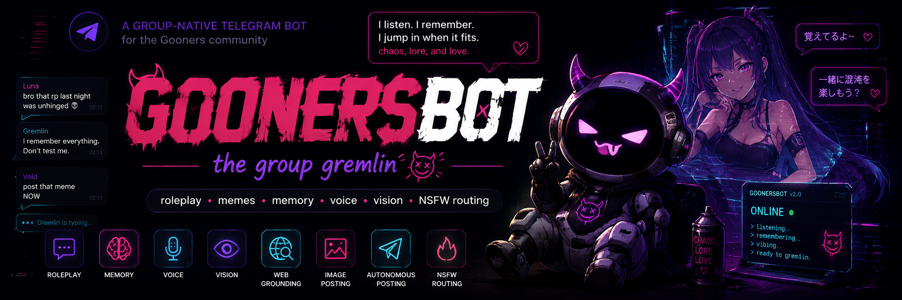

<p align="center">
  
</p>

<p align="center">
  = 22">
  
  
  
  
  
  
</p>

<h1 align="center">GoonersBot 🤖</h1>

<p align="center">
  <b>A group-native entertainment, roleplay, meme and memory Telegram bot for the <i>Gooners</i> community.</b><br>
  Not an assistant and not ChatGPT in a chat. It is a chat character that knows the group culture:
  it listens, remembers user and group lore, jumps in when it fits, runs chat modes, and keeps the
  group alive without spamming.
</p>

---

## Table of contents

- [Highlights](#highlights)
- [Quick start (no Docker)](#quick-start-no-docker)
- [Telegram setup and Privacy Mode](#telegram-setup-and-privacy-mode)
- [LLM providers](#llm-providers)
- [NSFW routing](#nsfw-routing)
- [Commands](#commands)
- [Built-in modes](#built-in-modes)
- [Voice (TTS and STT)](#voice-tts-and-stt)
- [Vision](#vision)
- [Web and image grounding](#web-and-image-grounding)
- [Per-user heat](#per-user-heat)
- [Knowledge base](#knowledge-base)
- [Images and autonomous posting](#images-and-autonomous-posting)
- [Brain and memory](#brain-and-memory)
- [Configuration](#configuration)
- [Security](#security)
- [Development and testing](#development-and-testing)
- [Troubleshooting](#troubleshooting)
- [License](#license)

---

## Highlights

- Group chat character: reads the room, replies in context, short and direct.
- Per-chat modes you add, select and delete at runtime, plus built-in Gooners modes.
- Memory: manual and mined facts about users and the group, retrieved only when relevant.
- Per-user heat: hostility escalates with users who push the bot and cools when they back off.
- Auto-engage: a scorer decides when to jump in (cooldowns, hourly cap, confidence, risk).
- Voice in and out: local whisper.cpp STT (voice, audio, video) and Kokoro TTS voice notes.
- Vision: looks at photos and video frames through a separate vision endpoint.
- Free grounding: web search and reverse-image lookup via a self-hosted SearXNG, no API keys.
- Image sending: fetches a waifu/anime image online and vision-checks it before posting.
- Autonomous posting: timed, opt-in takes on current events (RSS) or a commented image, plus `/news`.
- Music: `/play` and `/sing` (or natural language like "mi canti X", "suona X", "play X", "cantame X") search YouTube, extract the audio and send it as a voice note.
- Link media rehost: when a media URL is posted, the bot re-uploads it as a native Telegram attachment. Video streams (YouTube, TikTok, adult/cam, ...) are downloaded with yt-dlp; social posts (X, Instagram, Bluesky) are sent as images plus context (post text, likes, reposts). Results are cached by file_id, toggle per chat with `/linkmedia`.
- Translation: `/translate` (alias `/traduci`) translates the replied message into any language.
- NSFW routing to a separate uncensored model, decided before generation, with a refusal backstop.
- Pluggable LLM backends (GemRouter, OpenAI, DeepSeek, Ollama, any OpenAI-compatible host) with an
  optional fallback endpoint.
- No Docker and no Python. Node plus a local MongoDB. Strict TypeScript, ESM, eslint, prettier, vitest.

---

## Quick start (no Docker)

> Requirements: Node.js 23.3 (see `.nvmrc`) or a recent LTS, pnpm, and a running MongoDB.

```bash
# 1. Node
nvm use                      # picks up .nvmrc (23.3.0); or: nvm install 23.3.0

# 2. Install
pnpm install

# 3. MongoDB (any local instance). A helper for a user-local, auth-enabled mongod is included:
scripts/mongo-local.sh start         # or: sudo systemctl start mongod  / mongod --dbpath ./.mongo-data

# 4. Configure
cp .env.example .env
#   edit .env: set TELEGRAM_BOT_TOKEN, MONGO_URI and your LLM provider

# 5. Run
pnpm dev                     # watch mode (tsx)
# or production:
pnpm build && pnpm start
```

### Scripts

| Script                              | Purpose                                    |
| ----------------------------------- | ------------------------------------------ |
| `pnpm dev`                          | run with hot reload (tsx)                  |
| `pnpm build`                        | compile TypeScript to `dist/`              |
| `pnpm start`                        | run the compiled bot (`node dist/main.js`) |
| `pnpm typecheck`                    | strict type check, no emit                 |
| `pnpm lint` / `pnpm lint:fix`       | eslint                                     |
| `pnpm format` / `pnpm format:check` | prettier                                   |
| `pnpm test` / `pnpm test:watch`     | vitest                                     |

---

## Telegram setup and Privacy Mode

1. Create a bot with [@BotFather](https://t.me/BotFather) and copy the token into `TELEGRAM_BOT_TOKEN`.
2. Add the bot to your group.
3. Put the deployer's `@handle` in `ADMIN_HANDLES` so they can run control commands anywhere, even
   without being a group admin. `ALLOWED_HANDLES=*` lets everyone chat.

By default Telegram bots run with Privacy Mode ON: the bot only receives commands, replies to its own
messages, and messages that mention it. Make the bot a group admin or disable Privacy Mode in
@BotFather (`/setprivacy`, then remove and re-add the bot) only when you want it to retain unaddressed
text as lightweight conversation context. Unaddressed messages never trigger STT, media handling,
scene analysis, Cortex/evaluator calls, or any LLM request. A command, @mention, or reply to the bot
is required for inference. No group ID is ever hardcoded.

---

## LLM providers

Pick a provider with `LLM_PROVIDER`. Base URL and model are configurable, nothing is hardcoded in
business logic. Media capabilities activate only when you set the matching model var; if unset, that
capability is disabled and the bot degrades gracefully instead of crashing.

```env
# GemRouter (OpenAI-compatible root surface)
LLM_PROVIDER=custom_openai_compatible
LLM_BASE_URL=http://192.168.178.27:4024
LLM_API_KEY=<GemRouter app bearer token>
LLM_MODEL=gemini-2.5-flash
SCENE_MODEL=gemini-2.5-flash-lite
REALISTIC_EVALUATOR_MODEL=gemini-2.5-flash-lite
CORTEX_MODEL=gemini-2.5-flash-lite
EMBEDDING_BASE_URL=http://192.168.178.27:4024/v1
EMBEDDING_MODEL=bge-m3
LLM_VISION_ENDPOINT_URL=http://192.168.178.27:4024/v1/vision
LLM_VISION_MODEL=minicpm-v4.5:8b
# Every Free-group LLM stage uses this economy model instead of LLM_MODEL.
FREE_LLM_MODEL=gemma-4-26b-a4b-it

# DeepSeek
LLM_PROVIDER=deepseek
DEEPSEEK_API_KEY=<key>
DEEPSEEK_BASE_URL=https://api.deepseek.com
DEEPSEEK_MODEL=deepseek-chat

# Ollama / OpenAI / any OpenAI-compatible host
LLM_PROVIDER=ollama
LLM_BASE_URL=http://127.0.0.1:11434/v1
LLM_MODEL=llama3.1
```

An optional fallback endpoint (`LLM_FALLBACK_BASE_URL` + `LLM_FALLBACK_MODEL`) can be used for chat
and reasoning calls when the primary throws, but the production GoonerBot config keeps it empty so
the local MiniCPM box remains dedicated to vision. Vision, STT and TTS stay on their own providers.
The provider reports capabilities (`chat`, `vision`, `transcription`, `imageGeneration`, `tts`);
a missing one is logged once and skipped.

---

## NSFW routing

GoonersBot can route adult turns to a separate uncensored model while keeping a normal model for
everyday banter. Set `LLM_NSFW_MODEL`. Routing is decided before generation (no extra LLM call) and
gated per chat by an admin.

| `/nsfw <mode>`   | behaviour                                                                                                                                                                                                                                   |
| ---------------- | ------------------------------------------------------------------------------------------------------------------------------------------------------------------------------------------------------------------------------------------- |
| `base` (or `on`) | the whole chat uses the uncensored model.                                                                                                                                                                                                   |
| `off`            | never use the uncensored model.                                                                                                                                                                                                             |
| `smart`          | default. Per message: an instant lexicon picks the uncensored model for NSFW-looking turns; for the rest the default model runs with a buffered refusal backstop, so a refusal is silently retried on the uncensored model and never shown. |

A custom mode created with a leading `[nsfw]` tag always routes to the uncensored model in
NSFW-enabled chats. Hard limits always apply regardless of model or mode: nothing involving minors,
no real-world non-consent, no sexual content about real named people without consent, nothing
illegal, no doxxing. NSFW is opt-in per chat and meant for private, consenting adult communities. If
`LLM_NSFW_MODEL` is empty, all routing is inert and the default model is always used.

---

## Commands

| Command                      | Who           | What                                                                                     |
| ---------------------------- | ------------- | ---------------------------------------------------------------------------------------- |
| `/start`                     | admin         | wake GoonersBot in this chat                                                             |
| `/stop`                      | admin         | put it to sleep                                                                          |
| `/reset`                     | admin         | wipe conversation memory                                                                 |
| `/mode`                      | admin         | pick a mode                                                                              |
| `/addmode <description>`     | admin         | add a custom mode (`[nsfw]` prefix flags it adult)                                       |
| `/deletemode`                | admin         | delete a mode                                                                            |
| `/introduce <text>`          | anyone        | tell GoonersBot who you are (saved as lore)                                              |
| `/fact`                      | anyone        | mine durable lore from recent chat or the replied-to window                              |
| `/setfact @handle <text>`    | admin         | manually insert lore                                                                     |
| `/facts [@handle]`           | anyone        | show stored lore                                                                         |
| `/clearfacts [@handle]`      | self / admin  | expire stored lore (self anytime, others need admin)                                     |
| `/lore`                      | anyone        | top group lore (max 5)                                                                   |
| `/forget`                    | reply / admin | reply to forget lore mined from a message; admin `/forget <id>`                          |
| `/translate <language>`      | anyone        | translate the replied message (alias `/traduci`)                                         |
| `/voice`                     | anyone        | turn the last message, or the replied one, into a voice note                             |
| `/play <query>`              | anyone        | search YouTube and send the audio as a voice note (aliases `/suona`, `/riproduci`)       |
| `/sing <query>`              | anyone        | same as `/play`, phrased for songs (aliases `/canta`, `/cantami`)                        |
| `/news`                      | anyone        | force an autonomous post now (alias `/nuovo`)                                            |
| `/autopost`                  | admin         | toggle timed autonomous posts in this chat                                               |
| `/genera <prompt>`           | anyone        | generate an original image with Stable Diffusion (aliases `/image`, `/img`)              |
| `/disegna <prompt>`          | anyone        | force the high-quality PonyXL manga workflow (alias `/draw`)                             |
| `/usage`                     | anyone        | your usage and limits                                                                    |
| `/profile [free\|plus\|pro]` | admin         | show or set the shared group plan and live quotas (aliases: `/groupplan`, `/groupquota`) |
| `/language`                  | admin         | set chat language (it, en, ru, es)                                                       |
| `/terms`                     | anyone        | terms of use and acceptance                                                              |
| `/conversationtracker`       | admin         | toggle passive tracking                                                                  |
| `/autofact`                  | admin         | toggle automatic fact extraction                                                         |
| `/autoengage`                | admin         | show passive-reply status                                                                |
| `/nsfw [off\|base\|smart]`   | admin         | NSFW model routing                                                                       |
| `/ban @handle [seconds]`     | bot admin     | ban a Gooner (reply-aware, duration optional, 0 = permanent)                             |
| `/unban @handle`             | bot admin     | unban a Gooner                                                                           |
| `/brain`, `/debuglast`       | admin         | inspect why the bot answered the way it did                                              |
| `/approve [id]`              | bot admin     | approve a community chat or user (no id in a group = approve it)                         |
| `/unapprove [id]`            | bot admin     | revoke approval for a chat or user                                                       |
| `/approved`                  | bot admin     | list approved chats and users                                                            |
| `/help`                      | anyone        | help                                                                                     |

admin means group admin or bot admin (`ADMIN_HANDLES`). bot admin means listed in `ADMIN_HANDLES`.
Most commands that act on the chat need `/terms` accepted first. Outside the basic commands
(`/start`, `/tos`/`/terms`, `/help`) everything requires approval (see below).

---

## Access and approval

The model, media generation and link-media are gated: they work only for **bot admins**, **approved
user ids**, or **approved community chats**. Everyone else (including anyone who DMs the bot) is
limited to `/start`, `/tos`/`/terms` and `/help`, and gets a notice to request access; the model
never replies and nothing is generated for them.

- **Private DMs**: a stranger who messages the bot is asked to sign the terms, then receives a notice
  that this is an NSFW bot for approved private communities only and to DM the admin
  (`ADMIN_HANDLES`) for approval. No conversation, no generation.
- **Groups**: a group only gets the full bot once its chat id is approved; non-approved groups stay
  silent.
- **Approving**: a bot admin runs `/approve` inside a group to approve it, or `/approve <id>` from
  anywhere (negative id = chat, positive id = user). `/unapprove` and `/approved` manage the list.
- Approvals are seeded from `APPROVED_CHATS` / `APPROVED_USERS` on first run and then persisted to
  `APPROVED_STORE_PATH` (a JSON file, gitignored), so runtime `/approve` changes survive restarts.

---

## Group plans and quotas

Every approved group has one persistent plan. New groups start on **Free**; a group admin changes
the plan with `/profile free`, `/profile plus`, or `/profile pro`. `/profile` without arguments
shows current counters and limits. Limits reset on calendar boundaries in the `Europe/Rome` timezone.

| Resource                |           Free |           Plus |             Pro |
| ----------------------- | -------------: | -------------: | --------------: |
| Conversational requests | 12/day, 3/hour | 32/day, 9/hour | 72/day, 18/hour |
| LLM tokens              |        30k/day |       150k/day |        250k/day |
| Web searches            |          8/day |         33/day |          75/day |
| Opened/scanned pages    |         15/day |         75/day |         200/day |
| News retrievals         |          2/day |          9/day |          24/day |
| Generated images        |          1/day |         18/day |          48/day |
| Downloaded media        |  3/day, 100 MB | 20/day, 600 MB |  40/day, 1.2 GB |
| Passive LLM replies     |       disabled |       disabled |        disabled |
| Per-user cooldown       |           30 s |            6 s |             1 s |
| Per-chat cooldown       |           20 s |            3 s |             1 s |
| User/chat burst         |  1 / 3 per min | 6 / 16 per min | 20 / 60 per min |

Free groups are pinned to `FREE_LLM_MODEL` for every direct LLM operation (scene, evaluator/Cortex,
generation, translation, image-prompt preparation and manual fact extraction); embeddings retain their
separate configured endpoint. Free groups do not invoke the separate vision model and also skip
autonomous posting and background memory mining.
All plans store passive messages as context only and never infer or reply until the bot is addressed.

Semantic RAG uses `EMBEDDING_MODEL` (default `bge-m3`, 1024 dimensions) through GemRouter's
OpenAI-compatible `/v1/embeddings` endpoint. It helps group-memory retrieval, curated knowledge
matching and news ranking when the wording is not an exact keyword match. If embeddings are
unavailable or the vector dimension is wrong, the bot logs the failure and falls back to
keyword/Jaccard retrieval.

Live conversation attribution is tracked separately from durable RAG. The `conversation_threads`
and `conversation_entities` collections keep short-lived working memory such as "the RAV4 belongs
to @funboy" or "@miguel is commenting on @funboy's car thread". This state is injected compactly
before the generator so the bot can reply to the current speaker without stealing ownership of
topics introduced by someone else. Embeddings can help attach ambiguous follow-ups to the right
active thread, but ownership is always carried by Telegram metadata and structured entity fields,
not guessed from vector similarity. Configure it with `THREAD_STATE_ENABLED`,
`THREAD_STATE_TTL_DAYS`, and `THREAD_STATE_MAX_ACTIVE`.

The bot applies a per-user and per-chat anti-flood bucket before expensive work. Free is deliberately
strict; Plus allows normal group use; Pro has a much wider burst allowance while retaining hard
hour/day caps. Image generation is globally serialized: one image job runs at a time across every
group and the rest wait in queue. Counters are persisted atomically in Mongo, so restarting the bot
does not reset a group's budget.

---

## Built-in modes

| Mode            | Vibe                                                              |
| --------------- | ----------------------------------------------------------------- |
| `default`       | natural group participant, funny, short, contextual               |
| `roast`         | light roast and banter, never hateful, no protected categories    |
| `hype`          | hypes the group: raids, announcements, wins, updates              |
| `lorekeeper`    | tracks recurring jokes, group and user facts, callbacks           |
| `chaos`         | unpredictable but rate-limited and safe                           |
| `market_degen`  | crypto and degen vibes, never financial advice as certainty       |
| `meme_recorder` | turns funny moments into quote/meme candidates and remembers them |

Add your own with `/addmode <description>` (the mode name is the first sentence). Prefix with
`[nsfw]` to make it adult.

---

## Voice (TTS and STT)

- STT: a local whisper.cpp build transcribes incoming voice notes, audio files, videos and round
  video-notes. ffmpeg extracts the audio track from video containers, so the brain reads them as
  text and stores them as context. No cloud, modest CPU.
- TTS: an OpenAI-compatible `/v1/audio/speech` server (for example
  [Kokoro-FastAPI](https://github.com/remsky/Kokoro-FastAPI)) synthesizes replies. The bot finalizes
  the clip as Telegram OGG/Opus with a short silent tail (`TTS_TAIL_PADDING_MS`) when ffmpeg is
  available, which prevents clients from eating the last word.
- The bot replies with a voice note when you sent it one (`TTS_REPLY_TO_VOICE`), or occasionally on
  its own (`TTS_AUTO_VOICE_PROBABILITY`).
- `/voice` voices the last chat message, or the replied-to message when used as a reply.
- Multilingual: the TTS voice and whisper language follow the chat language (it `im_nicola`, en
  `am_michael`, es `em_alex`; no Russian voice, so it falls back to the default).

```bash
# 1. Provision the local toolchain into vendor/ (gitignored): static ffmpeg, whisper.cpp, model
scripts/setup-voice.sh           # or: scripts/setup-voice.sh small   (better Italian, more CPU)

# 2. Enable in .env
TTS_ENABLED=true
TTS_BASE_URL=http://<kokoro-host>:8880
TTS_VOICE=im_nicola
STT_ENABLED=true                 # paths default to the vendor/ build
```

Verify the round-trip with `pnpm tsx scripts/smoke-voice.ts`. The default whisper model is `base`
(multilingual, ~142 MB); set `WHISPER_MODEL` to `small` for better Italian at a bit more CPU. No GPU
required.

---

## Music (/play and /sing)

The bot can fetch a track from YouTube and send it as a voice note. It searches with yt-dlp,
downloads the best audio, trims to `MUSIC_MAX_DURATION_SECONDS` (12 minutes by default) and
transcodes to Telegram OGG/Opus.

- Commands: `/play <query>` (aliases `/suona`, `/riproduci`, `/reproduce`) and `/sing <query>`
  (aliases `/canta`, `/cantami`, `/cantame`). Used as a reply with no query, the replied message's
  text becomes the query. A direct YouTube URL also works.
- Natural language (Italian, English, Spanish), recognized when the bot is addressed
  (mention or reply): "mi fai sentire X", "mi canti X", "suona X", "play X", "sing me X",
  "let me hear X", "cantame X", "ponme X", "reproduce X".
- yt-dlp is installed into `vendor/bin/` by `scripts/setup-voice.sh` (alongside ffmpeg). Both are
  required; if either is missing the feature reports as unavailable and the rest of the bot is
  unaffected.

```bash
# Provisioned by scripts/setup-voice.sh; relevant .env knobs:
MUSIC_ENABLED=true
YTDLP_BIN=vendor/bin/yt-dlp
MUSIC_MAX_DURATION_SECONDS=720   # 12 minutes
```

---

## Link media rehost

When someone posts a media URL in the group, the bot downloads the real content and re-uploads it as
a native Telegram attachment (so it plays inline, with no preview-stripping), then caches the source
URL to a Telegram file_id so the next post of the same link is instant. Toggle per chat with
`/linkmedia` (admin; on by default).

### Two paths, on purpose

The bot picks the right kind of media per link:

- **Video -> the actual clip, via yt-dlp.** YouTube/Shorts, TikTok, Vimeo, Streamable, Twitch clips,
  Facebook, Dailymotion, Kick, Reddit video, Instagram reels, **video tweets**, and adult/cam sites
  are handled by the vendored `yt-dlp` binary (the same one `/play` uses). It picks the best clip up
  to 720p, merges video+audio with ffmpeg, and respects the size and duration caps. yt-dlp covers
  ~1800 sites, so most "here is a video" links just work. Reddit video and X video go through yt-dlp
  because their direct URLs are either split tracks (Reddit) or an uncapped 4K master (X).
- **Social photos -> image(s) + context.** A photo tweet (via the fxtwitter API) and Bluesky posts
  are sent as the image(s) with a caption carrying the context: the post text, the author, and the
  engagement counts (likes, reposts, replies, views). That context is also fed to the brain when the
  bot is tagged, so it can comment on what the post says, not just show it.
- **Live streams / unbounded video -> a single snapshot.** When a link is a live stream (or a video
  we cannot download within the caps), the bot grabs one frame with ffmpeg and posts that still
  instead, optionally with a vision description.

Direct file links (`.mp4`, `.gif`, `.jpg`, `.mp3`, ...), Imgur, Giphy and Tenor are fetched
directly; anything else falls back to a generic OpenGraph/JSON-LD scan.

> **Instagram needs cookies.** Logged-out Instagram no longer exposes media to scrapers or yt-dlp,
> so IG reels/posts only work if you set `LINK_MEDIA_COOKIES_INSTAGRAM` to either a raw Cookie header
> string or a path to a Netscape `cookies.txt` exported from a logged-in browser. Without it, IG
> links are silently skipped.

### Behaviour and safety

- Scope is deliberately small: a couple of links per message, a few files at most, with hard caps on
  count, size and duration. It is not a profile/feed crawler.
- Videos are sent as inline, autoplaying Telegram players: the mp4 is remuxed `+faststart` (moov
  atom moved to the front, no re-encode when already small) and uploaded with `supports_streaming`
  plus dimensions, duration and a generated poster thumbnail. GIFs become muted mp4 animations,
  audio becomes mp3.
- Short clips can be transcribed (STT) or frame-described (vision); that, plus the social post text
  and stats, is fed to the brain when the bot is tagged, so it can actually comment on the link.
- SSRF-guarded: only http/https, and hosts resolving to localhost/private/link-local/cloud-metadata
  addresses are refused. Per-chat and per-user cooldowns prevent spam.
- **Adult/cam** sites are supported but gated: they are skipped unless `LINK_MEDIA_NSFW_ALLOW=true`.
  Live cam streams (no fixed duration) are not captured, only recorded videos.

```bash
# Relevant .env knobs (full list in .env.example):
LINK_MEDIA_ENABLED=true
LINK_MEDIA_NSFW_ALLOW=false        # set true to allow adult/cam video hosts
LINK_MEDIA_MAX_URLS_PER_MESSAGE=2
LINK_MEDIA_MAX_UPLOAD_MB=45
LINK_MEDIA_MAX_DURATION_SECONDS=180
YTDLP_BIN=vendor/bin/yt-dlp        # shared with /play; scripts/setup-voice.sh installs it
```

> YouTube note: without a JavaScript runtime installed, yt-dlp can only fetch progressive
> (~360p) formats. That is fine for a Telegram rehost; install a JS runtime if you want higher
> resolutions.

---

## Vision

The bot can look at photos and at a frame extracted from a video, then react. Vision is gated by
`LLM_VISION_MODEL`. Production uses GemRouter's dedicated `/v1/vision` endpoint, backed by
`minicpm-v4.5:8b`; do not point the bot directly at Ollama for this flow:

```bash
# in .env:
LLM_VISION_MODEL=minicpm-v4.5:8b
LLM_VISION_ENDPOINT_URL=http://192.168.178.27:4024/v1/vision
LLM_VISION_API_KEY=                              # empty reuses LLM_API_KEY
```

Images are analysed only when the bot is addressed (mention or reply), for the current message or the
replied-to one. If the endpoint is down, vision degrades gracefully.

---

## Web and image grounding

When a turn needs facts the model cannot know, a grounding layer fetches them and injects a context
block; the persona model still writes the reply. Two heuristic-gated triggers run in parallel with
memory retrieval, both backed by a free self-hosted SearXNG (no API keys):

- Web search for recency or factual questions (who won yesterday, how much is the 5090, latest news).
- Image lookup for "who/what is this" or product questions: the vision model identifies the subject
  of a photo or video frame, then SearXNG searches that identification for confirmation and product
  links. This is the free equivalent of Google Lens, which now needs a headless browser and a public
  image URL.

Everything degrades to nothing on failure, and the model is told never to claim it searched the web.

```bash
# 1. One-time: clone SearXNG, venv, deps, settings, and install a systemd --user service
scripts/searxng.sh setup
# 2. Run it on 127.0.0.1:8888 (systemd --user service: auto-restart, survives reboot via lingering;
#    falls back to a plain process where systemd --user is unavailable)
scripts/searxng.sh start          # stop | restart | status

# 3. Enable in .env
WEB_SEARCH_ENABLED=true
SEARXNG_URL=http://127.0.0.1:8888
IMAGE_LOOKUP_ENABLED=true         # needs WEB_SEARCH_ENABLED and a vision model
```

Verify with `pnpm tsx scripts/smoke-search.ts`. Gating lives in `src/search/groundingService.ts`,
the SearXNG client in `src/search/searxng.ts`.

---

## Per-user heat

Hostility is tracked per user, per chat as a `heat` score from 0 to 100 (collection `user_heat`). It
starts gruff (`HEAT_BASELINE`), rises when someone attacks or pushes the bot, and decays over time,
faster when the user de-escalates (apologizes, calms down). The score maps to an escalation level
(baseline, irritato, ostile, incazzato, furia) that raises the aggression dial and injects a hostility
directive aimed at that specific user. So the bot can be venomous with one person and normal with the
rest. Logic in `src/services/heat.ts`; knobs `HEAT_ENABLED`, `HEAT_BASELINE`, `HEAT_DECAY_PER_MINUTE`.

---

## Knowledge base

A curated `knowledge` collection (anime, manga, otaku and Asian pop culture, gaming, IT and dev,
crypto, sci-fi and TV) is recalled only when relevant: a keyword match against the message surfaces
the top `KNOWLEDGE_MAX_ITEMS` entries as a short, clearly optional context block. Most turns match
nothing, so it adds no prompt weight and never makes the character monothematic. Seeded on boot from
`src/knowledge/seed.ts` (`KNOWLEDGE_SEED_ON_BOOT`, idempotent); retrieval in
`src/knowledge/knowledgeRetriever.ts`. Extend the seed freely.

---

## Images and autonomous posting

Sending images, free and without an image-generation model: the bot occasionally posts a waifu or
anime image that fits its taste. The image is fetched online through SearXNG image search, then
downloaded and looked at by the vision model before it is ever sent; off-theme, unsafe or real-person
results are rejected. In replies it attaches one at `IMAGE_SEND_PROBABILITY` when the topic is anime
or waifu. See `src/media/imageFinder.ts` (needs SearXNG and a vision model).

Autonomous posting: every `AUTOPOST_INTERVAL_MINUTES`, with `AUTOPOST_PROBABILITY` per eligible chat,
the bot drops an unprompted line. It is either a styled take on a current event pulled from RSS
(`RSS_FEEDS`) with the source link, or a commented waifu image, split by `AUTOPOST_IMAGE_RATIO`. It is
opt-in per chat (`/autopost`, default off) and can be forced on demand with `/news` (alias `/nuovo`).
Composer in `src/services/autonomousPoster.ts`, feeds in `src/news/newsService.ts`.

### Stable Diffusion generation

`/genera <prompt>` generates an original bitmap through a self-hosted Forge/Automatic1111 API;
`/image` and `/img` are aliases. The command turns the request into a concise English SD prompt before
generation. All workflows use Pony Diffusion XL: it stays loaded as the single checkpoint on the shared
Forge host, avoiding the RAM-heavy swaps that destabilize it. The configured primary LLM compiles every
request into scene tags; Pony-specific prompt profiles then distinguish anime, manga, photorealistic and
explicit-adult outputs.

`/disegna <prompt>` is intentionally separate: it forces Pony's manga workflow with Euler a,
manga key-visual prompting, clean ink lineart and screentone negatives. `/genera` keeps the generic
routing, with Pony score/rating/source tags matched to safe anime, realistic or explicit adult content.

The defaults are deliberately sized for a shared 12 GB RTX 3080 Ti: normal Pony renders use 28 steps;
OpenPose-guided renders use a reduced 22-step canvas to preserve VRAM headroom. Before a request the bot
polls Forge's global queue, and waits up to five minutes rather than treating a model load as downtime.

The normal news/web-image autopost pipeline never sends generated images. A separate generated-image
scheduler exists behind `GENERATED_IMAGE_AUTOPOST_ENABLED=false` and must remain off until explicitly
approved. Generated bitmaps are kept in memory for Telegram delivery, never written under the repo;
the `.gitignore` also excludes generated image artifact paths as a second guardrail.

---

## Brain and memory

GoonersBot does not dump facts into every prompt. Each reply runs a small pipeline so it behaves like a
real group member rather than a deterministic bot:

```text
message -> Scene Analyzer -> Memory Retriever (+ grounding, knowledge, heat in parallel) ->
           Reply Planner -> Style Engine -> Response Generator -> Ranker -> Repetition Guard ->
           reply  +  (background) Memory Mining and Feedback Learning
```

- Scene Analyzer reads topic, energy, intent and whether the bot is being roasted (LLM with a
  deterministic fallback).
- Memory Retriever pulls only the few memories relevant to this turn (scored by handle, keyword,
  topic and salience), skips recently-used ones, and returns nothing when the chat is roasting the bot
  for repetition.
- Reply Planner and Style Engine pick intent, tone, length and one of ten voice variants. A dynamic
  banned-phrases list, built from recent replies, kills repeated openings and catchphrase tics.
- The Generator produces one candidate by default (configurable). The Ranker and Repetition Guard
  drop assistant-tone, repeated or verbatim-memory replies and regenerate if needed.
- The reply always addresses the current speaker, and attached media carries who posted it so the
  roast target is unambiguous.
- Memory lives in `memory_items` (mined lore with confidence, salience and toxicity), not raw text.
  Background jobs mine lore while the bot is silent (in `/autofact` chats) and learn from feedback.
- Admins use `/brain` and `/debuglast` to see exactly why the bot answered the way it did.

Internal pipeline instructions are written in English (the model follows them best) while the bot is
told to reply in the chat language. The legacy `facts` collection is auto-migrated into `memory_items`
on first boot.

---

## Configuration

Validated with zod at startup; the bot fails fast on a missing or invalid required var. Optional
capabilities never block startup. Copy `.env.example` to `.env` (gitignored; never commit secrets).
The tables below list the common vars; see `.env.example` for the full set with comments.

### Core

| Variable             | Default                               | Description                                                           |
| -------------------- | ------------------------------------- | --------------------------------------------------------------------- |
| `TELEGRAM_BOT_TOKEN` | required                              | Token from @BotFather.                                                |
| `BOT_USERNAME`       | `GoonersBot`                          | Hint only; the real username is resolved at boot.                     |
| `ALLOWED_HANDLES`    | `*`                                   | Comma `@handles` allowed to use the bot. Empty or `*` means everyone. |
| `ADMIN_HANDLES`      | none                                  | Comma `@handles` that are bot admins.                                 |
| `MONGO_URI`          | `mongodb://127.0.0.1:27017/goonerbot` | Connection string.                                                    |
| `MONGO_DB`           | `goonerbot`                           | Database name.                                                        |
| `NODE_ENV`           | `development`                         | `production` gives JSON logs.                                         |
| `LOG_LEVEL`          | `info`                                | pino level.                                                           |

### LLM and media

| Variable                                                                | Default      | Description                                                             |
| ----------------------------------------------------------------------- | ------------ | ----------------------------------------------------------------------- |
| `LLM_PROVIDER`                                                          | `ollama`     | `solclawn`, `openai`, `deepseek`, `ollama`, `custom_openai_compatible`. |
| `LLM_BASE_URL`                                                          | per-provider | OpenAI-compatible base URL.                                             |
| `LLM_API_KEY`                                                           | none         | Bearer token.                                                           |
| `LLM_MODEL`                                                             | none         | Chat model (required for text replies).                                 |
| `FREE_LLM_MODEL`                                                        | `gemma-4-26b-a4b-it` | Economy model forced for every LLM operation in Free groups.        |
| `LLM_VISION_MODEL`                                                      | none         | Enables image and video-frame understanding.                            |
| `LLM_VISION_ENDPOINT_URL`                                               | none         | Full dedicated vision endpoint, e.g. GemRouter `/v1/vision`.            |
| `LLM_VISION_BASE_URL` / `LLM_VISION_API_KEY`                            | none         | Separate chat-compatible vision base; empty reuses the main one.        |
| `LLM_TRANSCRIPTION_MODEL`                                               | none         | Remote STT fallback; local whisper covers this otherwise.               |
| `LLM_TTS_MODEL` / `LLM_IMAGE_MODEL`                                     | none         | Enable remote TTS / image generation if your backend has them.          |
| `LLM_FALLBACK_BASE_URL` / `LLM_FALLBACK_MODEL` / `LLM_FALLBACK_API_KEY` | none         | Fallback chat endpoint when the primary throws.                         |
| `LLM_REQUEST_TIMEOUT_MS`                                                | `60000`      | Per-request timeout.                                                    |

### Voice, grounding, images, autopost

| Variable                                                                                        | Default                      | Description                                                                   |
| ----------------------------------------------------------------------------------------------- | ---------------------------- | ----------------------------------------------------------------------------- |
| `TTS_ENABLED` / `TTS_BASE_URL` / `TTS_VOICE` / `TTS_FORMAT`                                     | off                          | Kokoro TTS. Server audio is finalized for Telegram when ffmpeg is available.  |
| `TTS_TAIL_PADDING_MS`                                                                           | `600`                        | Silent tail appended after TTS so Telegram clients do not clip the last word. |
| `STT_ENABLED` / `WHISPER_MODEL` / `FFMPEG_BIN`                                                  | off                          | Local whisper.cpp STT (vendor/ defaults).                                     |
| `WEB_SEARCH_ENABLED` / `SEARXNG_URL`                                                            | off                          | Web grounding via SearXNG.                                                    |
| `IMAGE_LOOKUP_ENABLED`                                                                          | off                          | Reverse-image grounding (needs web search and vision).                        |
| `IMAGE_SEND_ENABLED` / `IMAGE_SEND_PROBABILITY`                                                 | on / `0.15`                  | Attach a verified waifu image on anime topics.                                |
| `IMAGE_QUERY_POOL`                                                                              | defaults                     | Comma-separated image query seeds.                                            |
| `SD_ENABLED` / `SD_API_URL`                                                                     | on / Forge URL               | Enable the self-hosted Forge/Automatic1111 generator.                         |
| `SD_ANIME_MODEL` / `SD_REALISTIC_MODEL` / `SD_NSFW_MODEL`                                       | PonyXL                       | Keep all three set to the same PonyXL checkpoint to avoid Forge model swaps.  |
| `SD_NEGATIVE_PROMPT` / `SD_STEPS` / `SD_WIDTH` / `SD_HEIGHT` / `SD_CFG_SCALE`                   | tuned defaults               | Shared Stable Diffusion generation controls.                                  |
| `SD_TIMEOUT_MS` / `SD_QUEUE_TIMEOUT_MS` / `SD_QUEUE_POLL_MS`                                    | `300000` / `300000` / `2000` | Per-render timeout and wait policy when Forge is busy.                        |
| `SD_CONTROLNET_ENABLED` / `SD_CONTROLNET_OPENPOSE_MODEL` / `SD_CONTROLNET_PROCESSOR_RESOLUTION` | on / `OpenPoseXL2` / `512`   | SearXNG pose-reference workflow for complex poses, tuned for the shared GPU.  |
| `AUTOPOST_ENABLED` / `AUTOPOST_DEFAULT_ENABLED`                                                 | on / off                     | Scheduler switch / per-chat default (opt-in).                                 |
| `AUTOPOST_INTERVAL_MINUTES` / `AUTOPOST_PROBABILITY`                                            | `10` / `0.05`                | Tick interval / chance per eligible chat.                                     |
| `AUTOPOST_IMAGE_RATIO`                                                                          | `0.4`                        | Share of autoposts that are an image vs a news take.                          |
| `GENERATED_IMAGE_AUTOPOST_ENABLED`                                                              | off                          | Separate generated-image scheduler; leave off until quality is approved.      |
| `GENERATED_IMAGE_AUTOPOST_INTERVAL_MINUTES` / `GENERATED_IMAGE_AUTOPOST_PROBABILITY`            | `10` / `0.05`                | Separate generated-image scheduler cadence, when enabled.                     |
| `RSS_FEEDS`                                                                                     | BBC, CNN, ANSA, Verge        | Comma-separated feed URLs.                                                    |

### NSFW, heat, knowledge, brain

| Variable                                                               | Default         | Description                                     |
| ---------------------------------------------------------------------- | --------------- | ----------------------------------------------- |
| `LLM_NSFW_MODEL`                                                       | none            | Uncensored model. Empty disables NSFW routing.  |
| `LLM_NSFW_DEFAULT_MODE`                                                | `smart`         | Initial per-chat mode: `off`, `base`, `smart`.  |
| `LLM_REFUSAL_FALLBACK`                                                 | `true`          | Retry on the NSFW model if the default refuses. |
| `HEAT_ENABLED` / `HEAT_BASELINE` / `HEAT_DECAY_PER_MINUTE`             | on / `12` / `1` | Per-user hostility escalation.                  |
| `KNOWLEDGE_ENABLED` / `KNOWLEDGE_MAX_ITEMS` / `KNOWLEDGE_SEED_ON_BOOT` | on / `2` / on   | On-demand knowledge recall.                     |
| `REPLY_TEMPERATURE` / `REPLY_CANDIDATE_COUNT`                          | `0.95` / `1`    | Generation temperature / candidates per reply.  |
| `MAX_REPLY_LINES` / `MAX_REPLY_CHARS`                                  | `3` / `420`     | Reply length caps.                              |
| `MEMORY_MINING_ENABLED` / `FEEDBACK_LEARNING_ENABLED`                  | on / on         | Background lore mining and feedback learning.   |

### Behaviour and limits

| Variable                                                               | Default     | Description                                                                         |
| ---------------------------------------------------------------------- | ----------- | ----------------------------------------------------------------------------------- |
| `DEFAULT_LANGUAGE`                                                     | `italian`   | `italian`, `english`, `russian`, `spanish`; per chat via `/language`.               |
| `AUTOENGAGE_DEFAULT_ENABLED` / `CONVERSATION_TRACKER_DEFAULT_ENABLED`  | on / on     | Initial toggles for new chats.                                                      |
| `MAX_REPLIES_PER_CHAT_PER_HOUR`                                        | `72`        | Global safety ceiling; the active `/profile` plan enforces the lower per-group cap. |
| `AUTOENGAGE_MIN_COOLDOWN_SECONDS` / `AUTOENGAGE_USER_COOLDOWN_SECONDS` | `45` / `20` | Passive-reply cooldowns.                                                            |
| `MESSAGE_HISTORY_RETENTION_DAYS` / `MAX_CONTEXT_MESSAGES`              | `30` / `25` | Message TTL / context window.                                                       |
| `COMMAND_RATE_LIMIT_SECONDS`                                           | `1`         | Min seconds between accepted commands per user.                                     |

---

## Security

GoonersBot is built for an authorized, self-hosted deployment.

| Area            | Posture                                                                                                                                                        |
| --------------- | -------------------------------------------------------------------------------------------------------------------------------------------------------------- |
| Secrets         | Only in `.env` (gitignored). No hardcoded tokens or keys in source. The LLM key is sent as a Bearer header and never logged.                                   |
| Logging         | Structured (pino). The bot token, LLM key and Mongo URI are never logged.                                                                                      |
| Auth            | Centralized permission service. Control commands require group admin or bot admin; `/ban` requires bot admin. Callback queries are permission-checked.         |
| Bans            | Gated on commands and in the message handler; timed bans auto-expire.                                                                                          |
| NoSQL injection | Mongo queries use fixed field names with user input only as scalar values; no `$where` or `eval`; ids guarded by `ObjectId.isValid`.                           |
| Rate limiting   | Per-user command cooldown, plan-aware per-group anti-flood, durable hourly/daily quotas, globally serialized image jobs, usage limits and media download caps. |
| Media and SSRF  | Inbound files come only from Telegram's file API. Outbound hosts are operator-configured, not user input. Fetched images are size-capped and vision-checked.   |
| MongoDB         | Run it bound to `127.0.0.1` with `--auth` and a least-privilege app user (`scripts/mongo-local.sh` does this).                                                 |
| Content safety  | NSFW is opt-in per chat with non-negotiable hard limits in the system prompt.                                                                                  |

Prompt-injection and jailbreak attempts in user messages are mitigated by system-prompt guardrails
but not eliminated; treat model output as untrusted. Keep `ADMIN_HANDLES` tight and Mongo off the
public network. To report a vulnerability, open a private security advisory on the repository.

---

## Development and testing

```bash
pnpm typecheck      # strict TS
pnpm lint           # eslint
pnpm format:check   # prettier
pnpm test           # vitest (unit tests use fakes, no live Mongo needed)
```

Optional integration and smoke harnesses live in `scripts/` and need a real Mongo or the matching
backend:

```bash
pnpm tsx scripts/smoke-integration.ts   # storage, LLM, reply and routing, end to end
pnpm tsx scripts/smoke-telegram.ts      # synthetic Telegram updates through the real bot
pnpm tsx scripts/smoke-voice.ts         # TTS to OGG/Opus to whisper round-trip
pnpm tsx scripts/smoke-search.ts        # SearXNG query and grounding gating
```

---

## Troubleshooting

| Symptom                               | Cause and fix                                                                                     |
| ------------------------------------- | ------------------------------------------------------------------------------------------------- |
| `/start` says you cannot do that here | You are not a group admin and not in `ADMIN_HANDLES`. Add your `@handle`.                         |
| Bot ignores normal messages           | Privacy Mode is ON. Disable it in @BotFather (then re-add the bot) or make the bot a group admin. |
| Replies in the wrong language         | Existing chats keep their stored language; run `/language`. New chats use `DEFAULT_LANGUAGE`.     |
| A capability is unavailable           | The relevant `LLM_*_MODEL` is not set (vision, image, transcription). Set it or ignore.           |
| Web search or images do nothing       | SearXNG is not running or `SEARXNG_URL` is wrong. Start it with `scripts/searxng.sh start`.       |
| Bot will not start                    | Read the fail-fast error, usually a missing `TELEGRAM_BOT_TOKEN` or unreachable `MONGO_URI`.      |

---

## License

See [LICENSE](./LICENSE.md).

Free for personal, educational, research, and other non-commercial use. Commercial use requires a separate license from 0xfunboy. Open an issue or use the contact information available on this GitHub profile to request permission.
