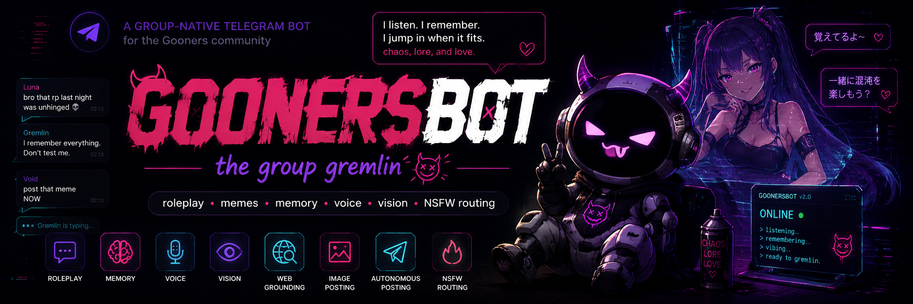

<p align="center">
  
</p>

<p align="center">
  = 22">
  
  
  
  
  
  
</p>

<h1 align="center">GoonersBot 🤖</h1>

<p align="center">
  <b>An independent, group-native Telegram assistant for the <i>Gooners</i> community.</b><br>
  It behaves like a specific foul-mouthed member of the group, while still doing real assistant
  work: it reads files and replied media, verifies current facts, remembers people and threads,
  uses tools honestly, and can acquire durable read-only research capabilities.
</p>

Current release: **2.0.0**. See [CHANGELOG.md](./CHANGELOG.md) for breaking changes and migration
notes.

---

## Table of contents

- [Highlights](#highlights)
- [Quick start (no Docker)](#quick-start-no-docker)
- [Telegram setup and Privacy Mode](#telegram-setup-and-privacy-mode)
- [LLM providers](#llm-providers)
- [NSFW routing](#nsfw-routing)
- [Commands](#commands)
- [Built-in modes](#built-in-modes)
- [Voice (TTS and STT)](#voice-tts-and-stt)
- [Vision](#vision)
- [Web and image grounding](#web-and-image-grounding)
- [Documents and attachments](#documents-and-attachments)
- [Capability Forge](#capability-forge)
- [Per-user heat](#per-user-heat)
- [Knowledge base](#knowledge-base)
- [Images and autonomous posting](#images-and-autonomous-posting)
- [Brain and memory](#brain-and-memory)
- [Configuration](#configuration)
- [Security](#security)
- [Development and testing](#development-and-testing)
- [Troubleshooting](#troubleshooting)
- [License](#license)

---

## Highlights

- Living group persona: learns every member's interests, habits and style; tracks relationships,
  evolving callbacks and group norms; supports first and roasts only when the scene permits it.
- Multi-action turns: a validated dependency graph can research, transform and generate several
  deliverables in one request, then Telegram sends every successful artifact.
- Document understanding: reads PDF, DOCX, text/Markdown, code, JSON, CSV, XML and HTML from the
  current message or the replied-to message; scanned PDFs are reported honestly when OCR is needed.
- Capability Forge: learns safe read-only research recipes, persists them, and exposes them as new
  slash commands without loading model-generated source code into the bot process.
- Per-chat modes you add, select and delete at runtime, plus built-in Gooners modes.
- Memory: every accepted chat message is mined asynchronously; only provenance-backed, durable
  social changes and episodic lore are retained and retrieved when relevant.
- Per-user heat: hostility escalates with users who push the bot and cools when they back off.
- Auto-engage: a scorer decides when to jump in (cooldowns, hourly cap, confidence, risk).
- Voice in and out: local whisper.cpp STT (voice, audio, video) and Kokoro TTS voice notes.
- Vision: looks at photos and video frames through a separate vision endpoint.
- Free grounding: web search and reverse-image lookup via a self-hosted SearXNG, no API keys.
- Image sending: fetches a waifu/anime image online and vision-checks it before posting.
- Autonomous posting: timed, opt-in takes on current events (RSS) or a commented image, plus `/news`.
- Music: `/play` and `/sing` (or natural language like "mi canti X", "suona X", "play X", "cantame X") search YouTube, extract the audio and send it as a voice note.
- Link media rehost: approved users can post YouTube Shorts, Instagram/Facebook Reels, TikTok,
  RedGifs, X/Reddit and other trusted video links; the bot downloads, normalizes and re-uploads them
  as native Telegram media. Galleries are delivered item by item and single files are cached by
  `file_id`. Toggle per chat with `/linkmedia`.
- Translation: `/translate` (alias `/traduci`) translates the replied message into any language.
- NSFW routing to a separate uncensored model, decided before generation, with a refusal backstop.
- Pluggable LLM backends (GemRouter, OpenAI, DeepSeek, Ollama, any OpenAI-compatible host) with an
  optional fallback endpoint.
- No Docker and no Python. Node plus a local MongoDB. Strict TypeScript, ESM, eslint, prettier, vitest.

---

## Quick start (no Docker)

> Requirements: Node.js 23.3 (see `.nvmrc`) or a recent LTS, pnpm, and a running MongoDB.

```bash
# 1. Node
nvm use                      # picks up .nvmrc (23.3.0); or: nvm install 23.3.0

# 2. Install
pnpm install

# 3. MongoDB (any local instance). A helper for a user-local, auth-enabled mongod is included:
scripts/mongo-local.sh start         # or: sudo systemctl start mongod  / mongod --dbpath ./.mongo-data

# 4. Configure
cp .env.example .env
#   edit .env: set TELEGRAM_BOT_TOKEN, MONGO_URI and your LLM provider

# 5. Run
pnpm dev                     # watch mode (tsx)
# or production:
pnpm build && pnpm start
```

### Scripts

| Script                              | Purpose                                    |
| ----------------------------------- | ------------------------------------------ |
| `pnpm dev`                          | run with hot reload (tsx)                  |
| `pnpm build`                        | compile TypeScript to `dist/`              |
| `pnpm start`                        | run the compiled bot (`node dist/main.js`) |
| `pnpm typecheck`                    | strict type check, no emit                 |
| `pnpm lint` / `pnpm lint:fix`       | eslint                                     |
| `pnpm format` / `pnpm format:check` | prettier                                   |
| `pnpm test` / `pnpm test:watch`     | vitest                                     |

---

## Telegram setup and Privacy Mode

1. Create a bot with [@BotFather](https://t.me/BotFather) and copy the token into `TELEGRAM_BOT_TOKEN`.
2. Add the bot to your group.
3. Put the deployer's `@handle` in `ADMIN_HANDLES` so they can run control commands anywhere, even
   without being a group admin. `ALLOWED_HANDLES=*` lets everyone chat.

By default Telegram bots run with Privacy Mode ON: the bot only receives commands, replies to its own
messages, and messages that mention it. Make the bot a group admin or disable Privacy Mode in
@BotFather (`/setprivacy`, then remove and re-add the bot) only when you want it to retain unaddressed
text as lightweight conversation context. Unaddressed messages never trigger STT, media handling,
scene analysis, Cortex/evaluator calls, or any LLM request. A command, @mention, or reply to the bot
is required for inference. No group ID is ever hardcoded.

---

## LLM providers

Pick a provider with `LLM_PROVIDER`. Base URL and model are configurable, nothing is hardcoded in
business logic. Media capabilities activate only when you set the matching model var; if unset, that
capability is disabled and the bot degrades gracefully instead of crashing.

```env
# GemRouter (OpenAI-compatible root surface)
LLM_PROVIDER=custom_openai_compatible
LLM_BASE_URL=http://192.168.178.27:4024
LLM_API_KEY=<GemRouter app bearer token>
LLM_MODEL=gemini-2.5-flash
SCENE_MODEL=gemini-2.5-flash-lite
REALISTIC_EVALUATOR_MODEL=gemini-2.5-flash-lite
CORTEX_MODEL=gemini-2.5-flash-lite
EMBEDDING_BASE_URL=http://192.168.178.27:4024/v1
EMBEDDING_MODEL=bge-m3
LLM_VISION_ENDPOINT_URL=http://192.168.178.27:4024/v1/vision
LLM_VISION_MODEL=minicpm-v4.5:8b
# Every Free-group LLM stage uses this economy model instead of LLM_MODEL.
FREE_LLM_MODEL=gemma-4-26b-a4b-it
# Background learning is pinned independently and never consumes chat-plan quota.
MINING_LLM_BASE_URL=http://192.168.178.27:4024
MINING_LLM_MODEL=gemma-4-31b-it
MINING_LLM_REQUEST_TIMEOUT_MS=180000
MINING_LLM_MAX_REQUESTS_PER_MINUTE=3
MINING_LLM_MAX_TOKENS_PER_MINUTE=15000

# DeepSeek
LLM_PROVIDER=deepseek
DEEPSEEK_API_KEY=<key>
DEEPSEEK_BASE_URL=https://api.deepseek.com
DEEPSEEK_MODEL=deepseek-chat

# Ollama / OpenAI / any OpenAI-compatible host
LLM_PROVIDER=ollama
LLM_BASE_URL=http://127.0.0.1:11434/v1
LLM_MODEL=llama3.1
```

An optional fallback endpoint (`LLM_FALLBACK_BASE_URL` + `LLM_FALLBACK_MODEL`) can be used for chat
and reasoning calls when the primary throws. It can now be followed by a free-tier provider pool:
Groq, Gemini, OpenRouter and Cloudflare Workers AI. A short circuit breaker avoids hammering a
provider after its quota is exhausted. Vision, STT and TTS stay on their own providers.

Continuous social/lore extraction has a separate `MINING_LLM_*` route. Its model is pinned, request
model overrides are ignored, the group-plan header is never forwarded and its tokens are not charged
to the conversational quota. GemRouter calls are FIFO, strictly serial and paced to at most three
actual upstream starts in any rolling minute, with at least 20 seconds between starts. JSON-mode
fallbacks and repair attempts use the same budget, so an extraction cannot create a hidden burst.
The same gate reserves a conservative maximum of 15,000 estimated tokens in any rolling minute and
rejects an impossible request before HTTP dispatch.
The 180-second timeout belongs only to this asynchronous provider; interactive chat keeps
`LLM_REQUEST_TIMEOUT_MS`.

The worker drains all unseen messages by Telegram `message_id` in bounded batches. Each successful
window advances a durable cursor/checkpoint; a timeout, malformed result or transient upstream
failure retains the same window and resumes later. Transient provider failures additionally open a
60-second cooldown before another slot can be consumed. Backfill and live mining share the same
serialized lane, so they cannot overlap. Confidence, provenance, privacy and deduplication still
decide what becomes memory.

Mining never serializes the whole memory database. It considers up to 1,000 retained items locally
for relevance and deduplication, sends at most 20 relevant items within 2.8 KB, focuses social
context on people present in the window and byte-packs transcript windows within 12 KB. The two
mining contracts omit a redundant generated JSON Schema but still apply strict local Zod validation
and bounded repair. Every eligible message id is processed.

On token-constrained Gemma Free routes, reply generation uses one candidate call instead of three
identical parallel prompts. Do not populate `LLM_ROUTER_FALLBACK_MODELS` with models served by the
same intelligent GemRouter: it already performs account/model fallback, so client retries to that
same endpoint only multiply the payload.

Free quotas are useful resilience layers, not unlimited production capacity. Configure only the
providers you actually have keys for and keep model ids explicit because catalogs change:

- [Groq OpenAI compatibility](https://console.groq.com/docs/openai) and
  [current free-plan limits](https://console.groq.com/docs/rate-limits)
- [Gemini OpenAI compatibility](https://ai.google.dev/gemini-api/docs/openai) and
  [current rate limits](https://ai.google.dev/gemini-api/docs/rate-limits)
- [OpenRouter free-model router](https://openrouter.ai/docs/cookbook/get-started/free-models-router-playground)
  and [rate-limit FAQ](https://openrouter.ai/docs/faq)
- [Cloudflare Workers AI OpenAI endpoint](https://developers.cloudflare.com/workers-ai/configuration/open-ai-compatibility/)
  and [free allocation/pricing](https://developers.cloudflare.com/workers-ai/platform/pricing/)

The provider reports capabilities (`chat`, `vision`, `transcription`, `imageGeneration`, `tts`);
a missing one is logged once and skipped.

---

## NSFW routing

GoonersBot can route adult turns to a separate uncensored model while keeping a normal model for
everyday banter. Set `LLM_NSFW_MODEL`. Routing is decided before generation (no extra LLM call) and
gated per chat by an admin.

| `/nsfw <mode>`   | behaviour                                                                                                                                                                                                                                   |
| ---------------- | ------------------------------------------------------------------------------------------------------------------------------------------------------------------------------------------------------------------------------------------- |
| `base` (or `on`) | the whole chat uses the uncensored model.                                                                                                                                                                                                   |
| `off`            | never use the uncensored model.                                                                                                                                                                                                             |
| `smart`          | default. Per message: an instant lexicon picks the uncensored model for NSFW-looking turns; for the rest the default model runs with a buffered refusal backstop, so a refusal is silently retried on the uncensored model and never shown. |

A custom mode created with a leading `[nsfw]` tag always routes to the uncensored model in
NSFW-enabled chats. Hard limits always apply regardless of model or mode: nothing involving minors,
no real-world non-consent, no sexual content about real named people without consent, nothing
illegal, no doxxing. NSFW is opt-in per chat and meant for private, consenting adult communities. If
`LLM_NSFW_MODEL` is empty, all routing is inert and the default model is always used.

---

## Commands

| Command                      | Who           | What                                                                                        |
| ---------------------------- | ------------- | ------------------------------------------------------------------------------------------- |
| `/start`                     | admin         | wake GoonersBot in this chat                                                                |
| `/stop`                      | admin         | put it to sleep                                                                             |
| `/reset`                     | admin         | wipe conversation memory                                                                    |
| `/mode`                      | admin         | pick a mode                                                                                 |
| `/addmode <description>`     | admin         | add a custom mode (`[nsfw]` prefix flags it adult)                                          |
| `/deletemode`                | admin         | delete a mode                                                                               |
| `/introduce <text>`          | anyone        | tell GoonersBot who you are (saved as lore)                                                 |
| `/setfact @handle <text>`    | admin         | manually insert lore                                                                        |
| `/facts [@handle]`           | self / admin  | show personal memory (`/memory` and `/memoria` aliases)                                     |
| `/clearfacts [@handle]`      | self / admin  | expire stored lore (self anytime, others need admin)                                        |
| `/lore`                      | anyone        | top group lore (max 5)                                                                      |
| `/forget`                    | reply / admin | reply to forget lore mined from a message; admin `/forget <id>`                             |
| `/translate <language>`      | anyone        | translate the replied message (alias `/traduci`)                                            |
| `/voice`                     | anyone        | turn the last message, or the replied one, into a voice note                                |
| `/play <query>`              | anyone        | search YouTube and send the audio as a voice note (aliases `/suona`, `/riproduci`)          |
| `/sing <query>`              | anyone        | same as `/play`, phrased for songs (aliases `/canta`, `/cantami`)                           |
| `/news`                      | anyone        | force an autonomous post now (alias `/nuovo`)                                               |
| `/autopost`                  | admin         | toggle timed autonomous posts in this chat                                                  |
| `/genera <prompt>`           | anyone        | generate an original image with Stable Diffusion (aliases `/image`, `/img`)                 |
| `/disegna <prompt>`          | anyone        | force manga planning/style while retaining capability routing (alias `/draw`)               |
| `/genvid <prompt>`           | anyone        | generate a short video clip (aliases `/video`, `/genvideo`, `/vid`, `/clip`, `/animazione`) |
| `/usage`                     | anyone        | your usage and limits                                                                       |
| `/capabilities`              | approved      | list dynamically learned read-only capabilities                                             |
| `/learn <goal>`              | bot admin     | explicitly design/install a safe research capability or save a setup proposal               |
| `/community`                 | anyone        | privacy-safe social-awareness coverage and current community themes                         |
| `/socialstatus`              | admin         | social-memory lifecycle/coverage diagnostics without exposing private scores                |
| `/profile [free\|plus\|pro]` | admin         | show or set the shared group plan and live quotas (aliases: `/groupplan`, `/groupquota`)    |
| `/language`                  | admin         | set chat language (it, en, ru, es)                                                          |
| `/terms`                     | anyone        | terms of use and acceptance                                                                 |
| `/conversationtracker`       | admin         | toggle passive tracking                                                                     |
| `/autoengage`                | admin         | show passive-reply status                                                                   |
| `/nsfw [off\|base\|smart]`   | admin         | NSFW model routing                                                                          |
| `/ban @handle [seconds]`     | bot admin     | ban a Gooner (reply-aware, duration optional, 0 = permanent)                                |
| `/unban @handle`             | bot admin     | unban a Gooner                                                                              |
| `/brain`, `/debuglast`       | admin         | inspect why the bot answered the way it did                                                 |
| `/approve [id]`              | bot admin     | approve a community chat or user (no id in a group = approve it)                            |
| `/unapprove [id]`            | bot admin     | revoke approval for a chat or user                                                          |
| `/approved`                  | bot admin     | list approved chats and users                                                               |
| `/help`                      | anyone        | help                                                                                        |

admin means group admin or bot admin (`ADMIN_HANDLES`). bot admin means listed in `ADMIN_HANDLES`.
Most commands that act on the chat need `/terms` accepted first. Outside the basic commands
(`/start`, `/tos`/`/terms`, `/help`) everything requires approval (see below).

---

## Access and approval

The model, media generation and link-media are gated: they work only for **bot admins**, **approved
user ids**, or **approved community chats**. Everyone else (including anyone who DMs the bot) is
limited to `/start`, `/tos`/`/terms` and `/help`, and gets a notice to request access; the model
never replies and nothing is generated for them.

- **Private DMs**: a stranger who messages the bot is asked to sign the terms, then receives a notice
  that this is an NSFW bot for approved private communities only and to DM the admin
  (`ADMIN_HANDLES`) for approval. No conversation, no generation.
- **Groups**: a group only gets the full bot once its chat id is approved; non-approved groups stay
  silent.
- **Approving**: a bot admin runs `/approve` inside a group to approve it, or `/approve <id>` from
  anywhere (negative id = chat, positive id = user). `/unapprove` and `/approved` manage the list.
- Approval alone does not schedule background work. On boot the bot audits every approved group
  with Telegram; mining, feedback and autonomous posts run only while its persisted status is
  `member` or `administrator`. `/approved` shows that status and the last successful audit.
- `my_chat_member` updates are persisted in an append-only `chat_membership_events` audit. A
  transition to `left` or `kicked` immediately stops the chat and disables autoengage, autopost and
  conversation tracking, even when no ordinary message can arrive after the removal.
- Approvals are seeded from `APPROVED_CHATS` / `APPROVED_USERS` on first run and then persisted to
  `APPROVED_STORE_PATH` (a JSON file, gitignored), so runtime `/approve` changes survive restarts.

---

## Group plans and quotas

Every approved group has one persistent plan. New groups start on **Free**; a group admin changes
the plan with `/profile free`, `/profile plus`, or `/profile pro`. `/profile` without arguments
shows current counters and limits. Limits reset on calendar boundaries in the `Europe/Rome` timezone.

| Resource                |           Free |           Plus |              Pro |
| ----------------------- | -------------: | -------------: | ---------------: |
| Conversational requests | 12/day, 3/hour | 32/day, 9/hour | 144/day, 30/hour |
| LLM tokens              |        30k/day |       150k/day |           2M/day |
| Web searches            |          8/day |         33/day |           75/day |
| Opened/scanned pages    |         15/day |         75/day |          200/day |
| News retrievals         |          2/day |          9/day |           24/day |
| Generated images        |          1/day |         18/day |           48/day |
| Downloaded media        |  3/day, 100 MB | 20/day, 600 MB |   40/day, 1.2 GB |
| Passive LLM replies     |       disabled |         9/hour |          12/hour |
| Per-user cooldown       |           30 s |            6 s |              1 s |
| Per-chat cooldown       |           20 s |            3 s |              1 s |
| User/chat burst         |  1 / 3 per min | 6 / 16 per min |  20 / 60 per min |

Free groups are pinned to `FREE_LLM_MODEL` for direct conversational LLM operations (scene,
evaluator/Cortex, generation, translation and image-prompt preparation); embeddings retain their
separate configured endpoint. Free groups do not invoke the separate vision model or autonomous
posting. Continuous background learning still runs for every started chat through the independent
plan-independent `MINING_LLM_*` route, configured for one request at a time and three starts per
minute. The miner also waits for a foreground quiet window so background extraction does not start
while an interactive LLM operation is active.
All plans store passive messages as context. With `/autoengage` enabled, Plus and Pro may additionally
run a compact Flash-Lite gate and chime in within their passive hourly allowance; approved passive
turns skip redundant scene/Cortex model calls but retain social memory, tools, style and final
generation.

Semantic RAG uses `EMBEDDING_MODEL` (default `bge-m3`, 1024 dimensions) through GemRouter's
OpenAI-compatible `/v1/embeddings` endpoint. It helps group-memory retrieval, curated knowledge
matching and news ranking when the wording is not an exact keyword match. If embeddings are
unavailable or the vector dimension is wrong, the bot logs the failure and falls back to
keyword/Jaccard retrieval.

Live conversation attribution is tracked separately from durable RAG. The `conversation_threads`
and `conversation_entities` collections keep short-lived working memory such as "the RAV4 belongs
to @funboy" or "@miguel is commenting on @funboy's car thread". This state is injected compactly
before the generator so the bot can reply to the current speaker without stealing ownership of
topics introduced by someone else. Embeddings can help attach ambiguous follow-ups to the right
active thread, but ownership is always carried by Telegram metadata and structured entity fields,
not guessed from vector similarity. Configure it with `THREAD_STATE_ENABLED`,
`THREAD_STATE_TTL_DAYS`, and `THREAD_STATE_MAX_ACTIVE`.

The bot applies a per-user and per-chat anti-flood bucket before expensive work. Free is deliberately
strict; Plus allows normal group use; Pro has a much wider burst allowance while retaining hard
hour/day caps. Image generation is globally serialized: one image job runs at a time across every
group and the rest wait in queue. Counters are persisted atomically in Mongo, so restarting the bot
does not reset a group's budget.

---

## Built-in modes

| Mode            | Vibe                                                              |
| --------------- | ----------------------------------------------------------------- |
| `default`       | natural group participant, funny, short, contextual               |
| `roast`         | light roast and banter, never hateful, no protected categories    |
| `hype`          | hypes the group: raids, announcements, wins, updates              |
| `lorekeeper`    | tracks recurring jokes, group and user facts, callbacks           |
| `chaos`         | unpredictable but rate-limited and safe                           |
| `market_degen`  | crypto and degen vibes, never financial advice as certainty       |
| `meme_recorder` | turns funny moments into quote/meme candidates and remembers them |

Add your own with `/addmode <description>` (the mode name is the first sentence). Prefix with
`[nsfw]` to make it adult.

---

## Voice (TTS and STT)

- STT: a local whisper.cpp build transcribes incoming voice notes, audio files, videos and round
  video-notes. ffmpeg extracts the audio track from video containers, so the brain reads them as
  text and stores them as context. No cloud, modest CPU.
- TTS: an OpenAI-compatible `/v1/audio/speech` server (for example
  [Kokoro-FastAPI](https://github.com/remsky/Kokoro-FastAPI)) synthesizes replies. The bot finalizes
  the clip as Telegram OGG/Opus with a short silent tail (`TTS_TAIL_PADDING_MS`) when ffmpeg is
  available, which prevents clients from eating the last word.
- The bot replies with a voice note when you sent it one (`TTS_REPLY_TO_VOICE`), or occasionally on
  its own (`TTS_AUTO_VOICE_PROBABILITY`).
- `/voice` voices the last chat message, or the replied-to message when used as a reply.
- Multilingual: the TTS voice and whisper language follow the chat language (it `im_nicola`, en
  `am_michael`, es `em_alex`; no Russian voice, so it falls back to the default).

```bash
# 1. Provision the local toolchain into vendor/ (gitignored): static ffmpeg, whisper.cpp, model
scripts/setup-voice.sh           # or: scripts/setup-voice.sh small   (better Italian, more CPU)

# 2. Enable in .env
TTS_ENABLED=true
TTS_BASE_URL=http://<kokoro-host>:8880
TTS_VOICE=im_nicola
STT_ENABLED=true                 # paths default to the vendor/ build
```

Verify the round-trip with `pnpm tsx scripts/smoke-voice.ts`. The default whisper model is `base`
(multilingual, ~142 MB); set `WHISPER_MODEL` to `small` for better Italian at a bit more CPU. No GPU
required.

---

## Music (/play and /sing)

The bot can fetch a track from YouTube and send it as a voice note. It searches with yt-dlp,
downloads the best audio, trims to `MUSIC_MAX_DURATION_SECONDS` (12 minutes by default) and
transcodes to Telegram OGG/Opus.

- Commands: `/play <query>` (aliases `/suona`, `/riproduci`, `/reproduce`) and `/sing <query>`
  (aliases `/canta`, `/cantami`, `/cantame`). Used as a reply with no query, the replied message's
  text becomes the query. A direct YouTube URL also works.
- Natural language (Italian, English, Spanish), recognized when the bot is addressed
  (mention or reply): "mi fai sentire X", "mi canti X", "suona X", "play X", "sing me X",
  "let me hear X", "cantame X", "ponme X", "reproduce X".
- yt-dlp is installed into `vendor/bin/` by `scripts/setup-voice.sh` (alongside ffmpeg). Both are
  required; if either is missing the feature reports as unavailable and the rest of the bot is
  unaffected.

```bash
# Provisioned by scripts/setup-voice.sh; relevant .env knobs:
MUSIC_ENABLED=true
YTDLP_BIN=vendor/bin/yt-dlp
MUSIC_MAX_DURATION_SECONDS=720   # 12 minutes
```

---

## Link media rehost

When an authorized user posts a media URL in an approved group or DM, the bot downloads the real
content and re-uploads it as a native Telegram attachment. Link interception is independent from
conversation tracking; `/linkmedia` controls it per chat (admin; on by default). Single-file results
are cached as Telegram `file_id`s, while galleries/carousels are delivered item by item so a cache
hit cannot collapse them to the first attachment. Instagram multi-video posts, TikTok photo-mode
shares and explicitly bounded playlist URLs run as one yt-dlp batch and deliver up to
`LINK_MEDIA_MAX_MEDIA_PER_URL` ordered video entries; Reels, Shorts and normal clip URLs stay
single-item jobs.

This deterministic pipeline runs before GoonersBot's conversational brain. It is the only authority
on whether a Telegram media artifact was actually delivered: resolving a page URL is never reported
as a successful download. For an unaddressed link, `/autoengage` off means rehost + caption only;
with `/autoengage` on, the normal passive-reply gate may add a separate comment after successful
delivery. A recognized download that fails stops at the deterministic failure notice instead of
being handed to an agent that could mistake the original link for an artifact.

### Two paths, on purpose

The bot picks the right kind of media per link:

- **Video -> the actual clip, via yt-dlp.** The curated registry includes YouTube/Shorts,
  Instagram/Facebook Reels, TikTok/Douyin, RedGifs, X, Reddit, Snapchat, Pinterest, Vimeo,
  Streamable, Twitch clips, Dailymotion, Kick, Rumble, Bilibili, VK, Loom, Medal and other established
  video hosts. It selects a <=720p stream, merges split video/audio, bounds retries and duration, and
  prefers H.264/AAC for Telegram. The registry is intentionally narrower than yt-dlp's full extractor
  list: arbitrary pages are never handed to an unrestricted subprocess. Operators can add a
  reviewed domain with `LINK_MEDIA_EXTRA_YTDLP_HOSTS`.
- **Social media -> attachment(s) + deterministic context.** Native X, Reddit and Bluesky APIs,
  OpenGraph/JSON-LD metadata and yt-dlp sidecars retain the available post description, author and
  engagement counts (likes, reposts/shares, comments/replies and views). This covers videos as well
  as photo galleries and does not require an LLM. Platforms omit some counters; absent values are
  not guessed. The context is also available to the brain only after successful delivery.
- **Live streams / unbounded video -> a single snapshot.** When a link is a live stream (or a video
  we cannot download within the caps), the bot grabs one frame with ffmpeg and posts that still
  instead, optionally with a vision description.

Direct files (`.mp4`, `.gif`, `.jpg`, `.mp3`, ...), Imgur, Giphy and Tenor are fetched directly;
other public pages get a bounded OpenGraph/HTML5/JSON-LD scan. HLS/DASH manifests require a curated
host or an explicit trusted-host entry because their nested requests cross the generic HTTP safety
boundary.

### Cookies and platform changes

Instagram and some Facebook/TikTok/YouTube posts commonly require a logged-in session. Prefer one
Netscape `cookies.txt` exported from a dedicated, low-privilege browser profile:

```bash
install -m 600 /secure/export/cookies.txt data/link-media.cookies.txt
# .env
LINK_MEDIA_COOKIES_FILE=data/link-media.cookies.txt
```

Never commit the jar or paste it into logs/chat. Site-specific `LINK_MEDIA_COOKIES_*` values override
the shared jar and retain raw Cookie-header compatibility. Every yt-dlp job works on its own mode-600
copy; graceful shutdown and a dead-process/age-guarded startup sweep remove scratch copies. Missing
access, quota exhaustion and bounded fallback failure are reported in chat instead of being silent.
For separate platform jars and future social clients, the guarded importer and exact environment
references are documented in `src/providers/socialClients/README.md`.

Social extractors change frequently. Keep the official standalone binary current; stable is the
default, while yt-dlp recommends trying nightly when a currently supported site breaks:

```bash
vendor/bin/yt-dlp -U
vendor/bin/yt-dlp --update-to nightly   # use when stable has a known extractor regression
```

### Behaviour and safety

- Scope is deliberately small: a couple of links per message, a few files at most, with hard caps on
  count, size and duration. It is not a profile/feed crawler.
- Videos are sent as inline, autoplaying Telegram players: the mp4 is remuxed `+faststart` (moov
  atom moved to the front, no re-encode when already small) and uploaded with `supports_streaming`
  plus dimensions, duration and a generated poster thumbnail. GIFs become muted mp4 animations,
  audio becomes mp3.
- Short clips can be transcribed (STT) or frame-described (vision); that, plus the social post text
  and stats, is fed to the brain when the bot is tagged, so it can actually comment on the link.
- SSRF-guarded: only http/https, and hosts resolving to localhost/private/link-local/cloud-metadata
  addresses are refused. Native downloads pin sockets to checked DNS results and re-check every
  redirect. yt-dlp and any ffmpeg child run in a bubblewrap network namespace with no direct egress;
  their only exit is a private local proxy which repeats DNS and blocked/NSFW policy checks for each
  HTTP request or HTTPS tunnel. If bubblewrap is missing, the default configuration disables the
  yt-dlp path instead of silently running it unisolated. Per-chat and per-user cooldowns prevent
  spam, and quotas are preflighted before expensive extraction then committed only for delivery.
- **Adult/cam** sites are supported but gated: they are skipped unless `LINK_MEDIA_NSFW_ALLOW=true`.
  RedGifs uses the same gate. Live cam streams (no fixed duration) are not captured, only recorded
  videos or a bounded still where available.
- Telegram upload degradation is explicit: video retries without a thumbnail, then as a document;
  large/incompatible photos, animations and audio also fall back to a document. Invalid cached
  `file_id`s are evicted and re-downloaded; transient Telegram errors retain the cache.

```bash
# Relevant .env knobs (full list in .env.example):
LINK_MEDIA_ENABLED=true
LINK_MEDIA_AUTO_REHOST=true
LINK_MEDIA_NSFW_ALLOW=false        # set true to allow adult/cam video hosts
LINK_MEDIA_MAX_URLS_PER_MESSAGE=2
LINK_MEDIA_MAX_MEDIA_PER_URL=6
LINK_MEDIA_MAX_UPLOAD_MB=45
LINK_MEDIA_MAX_DURATION_SECONDS=180
LINK_MEDIA_COOKIES_FILE=data/link-media.cookies.txt
LINK_MEDIA_EXTRA_YTDLP_HOSTS=      # only domains you explicitly trust
LINK_MEDIA_YTDLP_NETWORK_ISOLATION=true
LINK_MEDIA_BWRAP_BIN=/usr/bin/bwrap
YTDLP_BIN=vendor/bin/yt-dlp        # shared with /play; scripts/setup-voice.sh installs it
```

`LINK_MEDIA_PROXY` is retained for deployments with their own filtered egress proxy. While the
default bubblewrap isolation is enabled, the local guarded proxy takes precedence. Disable network
isolation only when the external proxy/firewall independently denies loopback, RFC1918, link-local
and cloud-metadata destinations for yt-dlp and all of its children.

The bot passes its own Node executable to yt-dlp as the JavaScript runtime by default. Override with
`LINK_MEDIA_YTDLP_JS_RUNTIME=deno:/usr/bin/deno` if the deployment standardizes on Deno. Browser
impersonation is attempted once only for Instagram/Facebook/TikTok failures; leave the global
`LINK_MEDIA_YTDLP_IMPERSONATE` override empty unless a reproducible case requires it.

For unmentioned group links, Telegram must actually deliver ordinary messages to the bot: make it a
group admin or disable Privacy Mode in BotFather. DMs additionally need `/start`, accepted terms and
an approved numeric user ID (`/approve <id>`).

---

## Vision

The bot can look at photos and at a frame extracted from a video, then react. Vision is gated by
`LLM_VISION_MODEL`. Production uses GemRouter's dedicated `/v1/vision` endpoint, backed by
`minicpm-v4.5:8b`; do not point the bot directly at Ollama for this flow:

```bash
# in .env:
LLM_VISION_MODEL=minicpm-v4.5:8b
LLM_VISION_ENDPOINT_URL=http://192.168.178.27:4024/v1/vision
LLM_VISION_API_KEY=                              # empty reuses LLM_API_KEY
```

Images are analysed only when the bot is addressed (mention or reply), for the current message or the
replied-to one. If the endpoint is down, vision degrades gracefully.

---

## Web and image grounding

When a turn needs facts the model cannot know, a grounding layer fetches them and injects a context
block; the persona model still writes the reply. Two heuristic-gated triggers run in parallel with
memory retrieval, both backed by a free self-hosted SearXNG (no API keys):

- Web search for recency or factual questions (who won yesterday, how much is the 5090, latest news).
- Image lookup for "who/what is this" or product questions: the vision model identifies the subject
  of a photo or video frame, then SearXNG searches that identification for confirmation and product
  links. This is the free equivalent of Google Lens, which now needs a headless browser and a public
  image URL.

Everything degrades to nothing on failure, and the model is told never to claim it searched the web.

```bash
# 1. One-time: clone SearXNG, venv, deps, settings, and install a systemd --user service
scripts/searxng.sh setup
# 2. Run it on 127.0.0.1:8888 (systemd --user service: auto-restart, survives reboot via lingering;
#    falls back to a plain process where systemd --user is unavailable)
scripts/searxng.sh start          # stop | restart | status

# 3. Enable in .env
WEB_SEARCH_ENABLED=true
SEARXNG_URL=http://127.0.0.1:8888
IMAGE_LOOKUP_ENABLED=true         # needs WEB_SEARCH_ENABLED and a vision model
```

Verify with `pnpm tsx scripts/smoke-search.ts`. Gating lives in `src/search/groundingService.ts`,
the SearXNG client in `src/search/searxng.ts`.

---

## Documents and attachments

PDF, DOCX, text/Markdown, source code, JSON, CSV, XML and HTML attachments are inputs to the same
assistant turn as the Telegram text. The bot inspects both the current message and the replied-to
message, so replying to an uploaded PDF with “summarise this” does not lose the file relationship.
Extraction is inert: macros, scripts, HTML JavaScript and code attachments are read as data and never
executed.

Selectable-text PDFs are extracted directly. Long documents are summarized from chunk-level notes
before synthesis rather than silently truncating to the first page. If a PDF is scanned or a format
is unsupported, the response names the actual limitation instead of claiming that no attachment
exists. Telegram's hosted Bot API download ceiling and the configured per-file/per-turn limits still
apply.

---

## Capability Forge

`/learn <goal>` lets a bot admin turn a missing, read-only research workflow into a persistent
declarative recipe. An installed recipe becomes a stable slash command, survives restart and uses
grounded search plus constrained synthesis; installation is published only after a live
search-and-synthesis smoke test succeeds. `/capabilities` lists what is currently available and
`/learn status` (or `/learn stato`) reports whether the forge, chat model, web grounding and
automatic installation are configured.

Explicit, clearly read-only research requests have a conservative local planning fallback, so a
malformed response or transient timeout from the capability-planning model does not lose an
otherwise safe `/learn`. The fallback rejects downloads, credentials, account access, external
writes and machine execution and still has to pass the same live smoke test before persistence.

Requests that need credentials, authenticated APIs, package installation, compilation, shell access,
local-machine control or external writes are saved as explicit setup proposals. Even when source code
is attached, the bot may inspect it to design the proposal but never executes it merely because it
arrived from Telegram. This keeps “learn while talking” useful without turning a message or a
prompt-injected document into remote code execution.

The command reports a structured lifecycle outcome (`installed`, `reused`, `proposal_saved`,
`blocked_dependency`, `validation_failed`, and so on). A proposal is a durable design artifact, not
an installed feature. Verified missing runtime configuration is named separately from work that
requires reviewed implementation; transient search/model failures are explicitly marked retryable.

---

## Per-user heat

Hostility is tracked per user, per chat as a `heat` score from 0 to 100 (collection `user_heat`). It
starts gruff (`HEAT_BASELINE`), rises when someone attacks or pushes the bot, and decays over time,
faster when the user de-escalates (apologizes, calms down). The score maps to an escalation level
(baseline, irritato, ostile, incazzato, furia) that raises the aggression dial and injects a hostility
directive aimed at that specific user. So the bot can be venomous with one person and normal with the
rest. Logic in `src/services/heat.ts`; knobs `HEAT_ENABLED`, `HEAT_BASELINE`, `HEAT_DECAY_PER_MINUTE`.

---

## Knowledge base

A curated `knowledge` collection (anime, manga, otaku and Asian pop culture, gaming, IT and dev,
crypto, sci-fi and TV) is recalled only when relevant: a keyword match against the message surfaces
the top `KNOWLEDGE_MAX_ITEMS` entries as a short, clearly optional context block. Most turns match
nothing, so it adds no prompt weight and never makes the character monothematic. Seeded on boot from
`src/knowledge/seed.ts` (`KNOWLEDGE_SEED_ON_BOOT`, idempotent); retrieval in
`src/knowledge/knowledgeRetriever.ts`. Extend the seed freely.

---

## Images and autonomous posting

Sending images, free and without an image-generation model: the bot occasionally posts a waifu or
anime image that fits its taste. The image is fetched online through SearXNG image search, then
downloaded and looked at by the vision model before it is ever sent; off-theme, unsafe or real-person
results are rejected. In replies it attaches one at `IMAGE_SEND_PROBABILITY` when the topic is anime
or waifu. See `src/media/imageFinder.ts` (needs SearXNG and a vision model).

Autonomous posting: every `AUTOPOST_INTERVAL_MINUTES`, with `AUTOPOST_PROBABILITY` per eligible chat,
the bot drops an unprompted line. It is either a styled take on a current event pulled from RSS
(`RSS_FEEDS`) with the source link, or a commented waifu image, split by `AUTOPOST_IMAGE_RATIO`. It is
opt-in per chat (`/autopost`, default off) and can be forced on demand with `/news` (alias `/nuovo`).
Composer in `src/services/autonomousPoster.ts`, feeds in `src/news/newsService.ts`.

### Generated-image planning and provider routing

`/genera`, `/disegna`, autonomous generated images and the cortex `image_gen` tool share one visual
pipeline. A loose request is not forwarded verbatim to a model:

```text
request + relevant continuity -> validated scene plan
                             -> Agnes natural-language prompt
                             -> PonyXL tag prompt + native negative prompt
                             -> capability-aware provider routing
                             -> generated bitmap
                             -> vision QA -> optional corrected retry -> best bitmap
```

The prompt model first returns a Zod-validated scene plan containing the locked medium, content
rating and aspect ratio; exact subject counts and per-subject descriptions/actions/positions;
interaction, framing, camera, setting, lighting, palette and mood; required and excluded details;
and any exact visible text. It must translate visual fields to English and cannot silently replace,
merge or add subjects. If structured generation fails, a deterministic scene contract preserves the
request instead of dropping image generation. Chat lore is considered only for an explicitly
referenced member/series or continuity request such as "same as before".

That single contract is compiled twice:

- **Agnes** receives an instruction-following natural-language prompt with literal subject counts,
  spatial relationships, composition, environment, hard requirements and exclusions.
- **PonyXL** receives concise booru-compatible content tags. Its checkpoint-specific quality,
  source and rating chain and its negative prompt are added only by the Forge provider.

The first provider is selected by capability, not by a fixed global preference. Explicit content
stays on Pony; focused anime, manga and pixel art normally prefer Pony; requested exact text,
multiple subjects, detail-dense contracts and the other visual media prefer Agnes. A pose reference
always uses local PonyXL + OpenPose. Either backend can fall back to the other when the requested
capability permits it. Independent five-minute circuits open after two consecutive Agnes or Forge
failures, while caller cancellations do not poison provider health.

Agnes uses the router's OpenAI-compatible `POST /v1/images/generations` with
the GemRouter-compatible exact sizes `1024x1024`, `1792x1024` and `1024x1792`. These preserve the
resolved `1:1`, `16:9` or `9:16` orientation through the router, whose current OpenAI validator
rejects Agnes' otherwise documented native `size: "1K"` plus `ratio` body. An explicit tool ratio
wins; otherwise square/avatar requests become `1:1`, vertical/story requests `9:16`, and
landscape/banner requests `16:9`, with `1:1` as the neutral default.
`AGNES_BASE_URL` and `AGNES_API_KEY` fall back to the main LLM route/key, while
`AGNES_IMAGE_ENABLED=false` removes Agnes from image routing without disabling local generation.

When vision is configured and `IMAGE_GENERATION_QA_ENABLED=true`, the generated bitmap is resized to
a bounded JPEG for inspection when ffmpeg is available, then scored against a compact quality brief
built from the original scene plan. Missing/extra main subjects, a wrong central action, medium or
framing, unreadable required text and severe anatomy are hard failures. A failed candidate gets a
bounded, focused retry: Pony-first focused art may move to Agnes, Agnes-first instruction-dense work
stays on Agnes, and pose-guided/explicit retries stay on Pony. The best inspected candidate is
returned if no attempt reaches the threshold. QA also reports
whether every visible person is unambiguously adult and independently classifies the pixels as
`safe`, `suggestive`, `explicit` or `uncertain`. Output above the requested rating is regenerated and
never returned after the retry budget: a safe request cannot leak an unspoilered explicit bitmap,
and suggestive work cannot leak explicit content. Suggestive and explicit scenes containing people
are not delivered when the adult-only check is missing or ambiguous; object-only adult scenes use
`no_people` instead. Any bitmap positively identified as minor/age-ambiguous is blocked at every
rating. Safe work remains fail-open only when vision itself is malformed or unavailable, so a flaky
inspector does not turn an otherwise safe image request into an error.

### Video generation

`/genvid <prompt>` renders a short clip with the remote `agnes-video-v2.0` model (aliases `/video`,
`/genvideo`, `/generavideo`, `/vid`, `/clip`, `/animazione`, `/genclip`). It is also reachable from
the classifier, so "generami un video dove un cane si morde la coda" works without a command: the
cortex `video_gen` tool is deliberately distinguished from `link_media` (which downloads media that
already exists) and from `image_gen` (a still image).

Practical notes:

- The request **blocks until the clip is rendered** (~1-2 minutes), and upstream allows **one video
  per minute**; a local cooldown gates callers before the slot is spent and a rate-limited request
  answers "try again in Ns" instead of failing silently.
- Generated mp4s ship with the moov atom at the end, which Telegram cannot stream, so every clip is
  remuxed `+faststart` (stream copy) and sent with `supports_streaming`, dimensions, duration and a
  poster: it arrives as an inline autoplaying video, not a file to download.
- A clip spends the group's generated-image quota, and NSFW prompts are sent with a spoiler overlay.

```bash
AGNES_VIDEO_ENABLED=true
AGNES_VIDEO_MODEL=agnes-video-v2.0
AGNES_VIDEO_MIN_INTERVAL_MS=60000   # upstream allows 1 video/minute
```

### Stable Diffusion generation (local PonyXL backend)

`/genera <prompt>` generates an original bitmap through a self-hosted Forge/Automatic1111 API;
`/image` and `/img` are aliases. All local workflows use Pony Diffusion XL: it stays loaded as the
single checkpoint on the shared Forge host, avoiding the RAM-heavy swaps that destabilize it. Model
selection still understands anime/manga/comic, general/photographic and explicit profiles, so an
operator may configure separate checkpoints later without changing the scene compiler.

`/disegna <prompt>` is intentionally separate: it forces the manga medium/profile, including manga
prompting, clean ink lineart and screentone negatives when Pony is selected. It still retains
capability routing, so exact-text, multi-subject or instruction-dense manga can use Agnes.
`/genera` infers both medium and routing.
Every Pony prompt receives the complete positive score chain
`score_9, score_8_up, score_7_up, score_6_up, score_5_up, score_4_up`, the appropriate
`source_anime`/`source_cartoon` tag when applicable, and one of
`rating_safe`, `rating_questionable` or `rating_explicit`. The native Forge `negative_prompt` merges
the operator baseline, medium/rating defects and scene-specific exclusions while deduplicating them;
low score tags `score_3, score_2, score_1` remain negative rather than contaminating the positive
prompt. The compiler also translates prose that Pony commonly misreads into checkpoint-native
framing/background tags (`upper body`, `waist up`, `simple background`) and contextual negatives:
for example, a requested bust portrait suppresses full-body framing, while an unarmed warrior does
not silently acquire a sword.

The defaults are deliberately sized for a shared 12 GB RTX 3080 Ti: normal Pony renders use 28 steps;
the selected aspect ratio maps to `1024x1024`, `1152x640` or `640x1152`. OpenPose-guided renders use
a reduced 22-step canvas to preserve VRAM headroom. Before a request the bot polls Forge's global
queue and re-verifies the process-wide checkpoint because the frontend may have changed it. Forge
response bodies remain under the render timeout and a 32 MB cap. Image jobs and their QA retries
remain globally serialized. OpenPose search is restricted to genuinely complex interactions, checks
at most two candidates and caches a verified neutral pose for 30 minutes.

The normal news/web-image autopost pipeline never sends generated images. A separate generated-image
scheduler exists behind `GENERATED_IMAGE_AUTOPOST_ENABLED=false` and must remain off until explicitly
approved. Generated bitmaps are kept in memory for Telegram delivery, never written under the repo;
the `.gitignore` also excludes generated image artifact paths as a second guardrail.

---

## Brain and memory

GoonersBot does not dump facts into every prompt. Each reply runs a bounded pipeline so it behaves
like a real group member rather than a deterministic bot:

```text
message + replied media -> Perception -> Scene + Social Awareness + Memory Retriever ->
                           Cortex -> Multi-action DAG -> verified tools/artifacts ->
                           Reply Planner -> Style Engine -> Generator -> Ranker ->
                           semantic Repetition Guard -> reply + every artifact
                           + (background) Social/Memory/Feedback Learning
```

- Scene Analyzer reads topic, energy, intent and whether the bot is being roasted (LLM with a
  deterministic fallback).
- Memory Retriever pulls only the few memories relevant to this turn (scored by handle, keyword,
  topic and salience), skips recently-used ones, and returns nothing when the chat is roasting the bot
  for repetition.
- Reply Planner and Style Engine pick intent, tone, length and one of ten voice variants. A dynamic
  banned-phrases list plus premise/mechanism history kills repeated openings, recycled roast shapes
  and catchphrase tics. Gratitude, distress and serious requests suppress gratuitous hostility.
- The Generator samples three candidates by default (configurable). The Ranker and Repetition Guard
  use stale openings, premises and comedy strategies as ranking penalties instead of rejecting every
  otherwise useful answer. Lexical clones above `REPETITION_SIMILARITY_THRESHOLD`, stricter
  high-confidence semantic clones, explicitly banned/canned phrases, unauthorized verbatim-memory
  callbacks, internal deflection messages and social-floor violations are hard blocks. The best
  acceptable candidate is used immediately.
- Ranking has a deterministic local fallback. If every candidate is hard-blocked, the bot performs
  one bounded regeneration; if that still produces only repetitive but socially safe, substantive
  text, it sends the best usable answer instead of the old evasive “rephrase and try again” message.
  Last-resort recovery may relax only repetition/canned-style blocks: it never revives unauthorized
  memory, a social-floor violation or an internal deflection. If no safe candidate exists, the
  fallback gives concise support or states the exact missing evidence/context without discussing the
  hidden generation pipeline.
- Social memory keeps evolving profiles, relationships, shared norms and running jokes with
  provenance, confidence, contradiction handling, lifecycle decay and fatigue. Reactions to the
  exact bot message teach which style variants and comedy mechanisms work for each person. A
  checkpointed startup backfill covers the full retained history; invalid structured output never
  advances the learning cursor, and a privacy-filtered local baseline keeps explicit declarations
  usable during an upstream outage.
- A multi-action planner may chain and parallelize available tools. Dependency failures are isolated,
  successful outputs are verified, and partial completion is reported honestly.
- The reply always addresses the current speaker, and attached media carries who posted it so the
  roast target is unambiguous.
- Memory lives in `memory_items` (mined lore with confidence, salience and toxicity), not raw text.
  Social profiles live separately, so changing interests supersede stale claims instead of creating
  contradictory lore. Both projections evolve continuously in every started chat, including Free
  groups, from a dedicated pinned model. `/fact` and `/autofact` no longer exist: `/facts`,
  `/clearfacts`, `/forget`, `/introduce` and admin `/setfact` remain as transparency, erasure and
  correction controls.
- Admins use `/brain` and `/debuglast` to see exactly why the bot answered the way it did.

Internal pipeline instructions are written in English (the model follows them best) while the bot is
told to reply in the chat language. The legacy `facts` collection is auto-migrated into `memory_items`
on first boot.

---

## Configuration

Validated with zod at startup; the bot fails fast on a missing or invalid required var. Optional
capabilities never block startup. Copy `.env.example` to `.env` (gitignored; never commit secrets).
The tables below list the common vars; see `.env.example` for the full set with comments.

### Core

| Variable             | Default                               | Description                                                           |
| -------------------- | ------------------------------------- | --------------------------------------------------------------------- |
| `TELEGRAM_BOT_TOKEN` | required                              | Token from @BotFather.                                                |
| `BOT_USERNAME`       | `GoonersBot`                          | Hint only; the real username is resolved at boot.                     |
| `ALLOWED_HANDLES`    | `*`                                   | Comma `@handles` allowed to use the bot. Empty or `*` means everyone. |
| `ADMIN_HANDLES`      | none                                  | Comma `@handles` that are bot admins.                                 |
| `MONGO_URI`          | `mongodb://127.0.0.1:27017/goonerbot` | Connection string.                                                    |
| `MONGO_DB`           | `goonerbot`                           | Database name.                                                        |
| `NODE_ENV`           | `development`                         | `production` gives JSON logs.                                         |
| `LOG_LEVEL`          | `info`                                | pino level.                                                           |

### LLM and media

| Variable                                                                  | Default                  | Description                                                             |
| ------------------------------------------------------------------------- | ------------------------ | ----------------------------------------------------------------------- |
| `LLM_PROVIDER`                                                            | `ollama`                 | `solclawn`, `openai`, `deepseek`, `ollama`, `custom_openai_compatible`. |
| `LLM_BASE_URL`                                                            | per-provider             | OpenAI-compatible base URL.                                             |
| `LLM_API_KEY`                                                             | none                     | Bearer token.                                                           |
| `LLM_MODEL`                                                               | none                     | Chat model (required for text replies).                                 |
| `FREE_LLM_MODEL`                                                          | `gemma-4-26b-a4b-it`     | Economy model forced for every LLM operation in Free groups.            |
| `MINING_LLM_BASE_URL` / `MINING_LLM_API_KEY`                              | main LLM route/key       | Independent OpenAI-compatible endpoint/key for continuous learning.     |
| `MINING_LLM_MODEL`                                                        | `gemma-4-31b-it`         | Pinned background lore/social model; request overrides are ignored.     |
| `MINING_LLM_REQUEST_TIMEOUT_MS`                                           | `180000`                 | Timeout only for one queued background structured call.                 |
| `MINING_LLM_MAX_REQUESTS_PER_MINUTE`                                      | `3`                      | Mining-provider cap; default pacing starts calls at least 20s apart.    |
| `MINING_LLM_MAX_TOKENS_PER_MINUTE`                                        | `15000`                  | Conservative rolling mining token envelope, including output reserve.   |
| `MINING_LLM_FOREGROUND_QUIET_MS`                                          | `15000`                  | Defer new mining calls while/just after interactive LLM work.           |
| `LLM_VISION_MODEL`                                                        | none                     | Enables image and video-frame understanding.                            |
| `LLM_VISION_ENDPOINT_URL`                                                 | none                     | Full dedicated vision endpoint, e.g. GemRouter `/v1/vision`.            |
| `LLM_VISION_BASE_URL` / `LLM_VISION_API_KEY`                              | none                     | Separate chat-compatible vision base; empty reuses the main one.        |
| `LLM_TRANSCRIPTION_MODEL`                                                 | none                     | Remote STT fallback; local whisper covers this otherwise.               |
| `LLM_TTS_MODEL` / `LLM_IMAGE_MODEL`                                       | none                     | Enable remote TTS / image generation if your backend has them.          |
| `LLM_FALLBACK_BASE_URL` / `LLM_FALLBACK_MODEL` / `LLM_FALLBACK_API_KEY`   | none                     | Fallback chat endpoint when the primary throws.                         |
| `LLM_ROUTER_FALLBACK_MODELS`                                              | none                     | Ordered alternative models on the primary gateway, reusing its URL/key. |
| `GROQ_API_KEY` / `GROQ_MODEL`                                             | none / GPT-OSS           | Optional Groq free-tier fallback.                                       |
| `GEMINI_API_KEY` / `GEMINI_MODEL`                                         | none                     | Optional Gemini free-tier fallback; model must be explicit.             |
| `OPENROUTER_API_KEY` / `OPENROUTER_MODEL`                                 | none / `openrouter/free` | Optional free-model router fallback.                                    |
| `CLOUDFLARE_AI_API_KEY` / `CLOUDFLARE_ACCOUNT_ID` / `CLOUDFLARE_AI_MODEL` | none                     | Optional Workers AI free-allocation fallback.                           |
| `LLM_REQUEST_TIMEOUT_MS`                                                  | `60000`                  | Per-request timeout.                                                    |

Structured internal calls use JSON mode plus a generated JSON Schema, strict Zod validation and one
validation-error-guided repair. Circuit breakers are operation-specific: a model that temporarily
fails social/planner JSON is not automatically removed from ordinary chat.

The mining timeout and pacing apply only to the dedicated provider. They do not replace
`LLM_REQUEST_TIMEOUT_MS`, delay an interactive reply or expand a conversational group's plan. The
minimum start gap is derived from the configured RPM (`ceil(60000 / RPM)`); leave the production
value at `3` for GemRouter.

### Voice, grounding, images, autopost

| Variable                                                                                        | Default                      | Description                                                                   |
| ----------------------------------------------------------------------------------------------- | ---------------------------- | ----------------------------------------------------------------------------- |
| `TTS_ENABLED` / `TTS_BASE_URL` / `TTS_VOICE` / `TTS_FORMAT`                                     | off                          | Kokoro TTS. Server audio is finalized for Telegram when ffmpeg is available.  |
| `TTS_TAIL_PADDING_MS`                                                                           | `600`                        | Silent tail appended after TTS so Telegram clients do not clip the last word. |
| `STT_ENABLED` / `WHISPER_MODEL` / `FFMPEG_BIN`                                                  | off                          | Local whisper.cpp STT (vendor/ defaults).                                     |
| `WEB_SEARCH_ENABLED` / `SEARXNG_URL`                                                            | off                          | Web grounding via SearXNG.                                                    |
| `DOCUMENTS_ENABLED` / `DOCUMENT_MAX_CHARS_PER_FILE`                                             | on / `50000`                 | Read current/replied PDF, DOCX and text-like documents as inert content.      |
| `CAPABILITY_FORGE_ENABLED` / `CAPABILITY_STORE_PATH`                                            | on / `data/capabilities`     | Persist safe read-only research recipes and setup proposals.                  |
| `IMAGE_LOOKUP_ENABLED`                                                                          | off                          | Reverse-image grounding (needs web search and vision).                        |
| `IMAGE_SEND_ENABLED` / `IMAGE_SEND_PROBABILITY`                                                 | on / `0.15`                  | Attach a verified waifu image on anime topics.                                |
| `IMAGE_QUERY_POOL`                                                                              | defaults                     | Comma-separated image query seeds.                                            |
| `IMAGE_GENERATION_QA_ENABLED`                                                                   | on                           | Vision-check generated images against their structured scene plan.            |
| `IMAGE_GENERATION_QA_MIN_SCORE` / `IMAGE_GENERATION_QA_MAX_RETRIES`                             | `0.72` / `1`                 | Acceptance threshold / bounded corrective generations (`0..2`).               |
| `AGNES_BASE_URL` / `AGNES_API_KEY`                                                              | main LLM route/key           | Optional dedicated router endpoint and bearer token for Agnes media.          |
| `AGNES_IMAGE_ENABLED` / `AGNES_IMAGE_MODEL`                                                     | on / `agnes-image-2.1-flash` | Enable the instruction-following image route; Pony remains available.         |
| `AGNES_IMAGE_TIMEOUT_MS` / `AGNES_IMAGE_MAX_MB`                                                 | `120000` / `25`              | Remote render timeout and bounded returned-image size.                        |
| `SD_ENABLED` / `SD_API_URL`                                                                     | on / Forge URL               | Enable the self-hosted Forge/Automatic1111 generator.                         |
| `SD_ANIME_MODEL` / `SD_REALISTIC_MODEL` / `SD_NSFW_MODEL`                                       | PonyXL                       | Keep all three set to the same PonyXL checkpoint to avoid Forge model swaps.  |
| `SD_NEGATIVE_PROMPT` / `SD_STEPS`                                                               | tuned defaults               | Pony baseline negative and sampling floor.                                    |
| `SD_WIDTH` / `SD_HEIGHT` / `SD_CFG_SCALE`                                                       | compatibility values         | Legacy/direct workflow values; planned requests use the tuned ratio presets.  |
| `SD_TIMEOUT_MS` / `SD_QUEUE_TIMEOUT_MS` / `SD_QUEUE_POLL_MS`                                    | `300000` / `300000` / `2000` | Per-render timeout and wait policy when Forge is busy.                        |
| `SD_CONTROLNET_ENABLED` / `SD_CONTROLNET_OPENPOSE_MODEL` / `SD_CONTROLNET_PROCESSOR_RESOLUTION` | on / `OpenPoseXL2` / `512`   | SearXNG pose-reference workflow for complex poses, tuned for the shared GPU.  |
| `AUTOPOST_ENABLED` / `AUTOPOST_DEFAULT_ENABLED`                                                 | on / off                     | Scheduler switch / per-chat default (opt-in).                                 |
| `AUTOPOST_INTERVAL_MINUTES` / `AUTOPOST_PROBABILITY`                                            | `10` / `0.05`                | Tick interval / chance per eligible chat.                                     |
| `AUTOPOST_IMAGE_RATIO`                                                                          | `0.4`                        | Share of autoposts that are an image vs a news take.                          |
| `GENERATED_IMAGE_AUTOPOST_ENABLED`                                                              | off                          | Separate generated-image scheduler; leave off until quality is approved.      |
| `GENERATED_IMAGE_AUTOPOST_INTERVAL_MINUTES` / `GENERATED_IMAGE_AUTOPOST_PROBABILITY`            | `10` / `0.05`                | Separate generated-image scheduler cadence, when enabled.                     |
| `RSS_FEEDS`                                                                                     | BBC, CNN, ANSA, Verge        | Comma-separated feed URLs.                                                    |

### NSFW, heat, knowledge, brain

| Variable                                                               | Default         | Description                                             |
| ---------------------------------------------------------------------- | --------------- | ------------------------------------------------------- |
| `LLM_NSFW_MODEL`                                                       | none            | Uncensored model. Empty disables NSFW routing.          |
| `LLM_NSFW_DEFAULT_MODE`                                                | `smart`         | Initial per-chat mode: `off`, `base`, `smart`.          |
| `LLM_REFUSAL_FALLBACK`                                                 | `true`          | Retry on the NSFW model if the default refuses.         |
| `HEAT_ENABLED` / `HEAT_BASELINE` / `HEAT_DECAY_PER_MINUTE`             | on / `12` / `1` | Per-user hostility escalation.                          |
| `KNOWLEDGE_ENABLED` / `KNOWLEDGE_MAX_ITEMS` / `KNOWLEDGE_SEED_ON_BOOT` | on / `2` / on   | On-demand knowledge recall.                             |
| `REPLY_TEMPERATURE` / `REPLY_CANDIDATE_COUNT`                          | `0.95` / `3`    | Generation temperature / candidates per reply.          |
| `REPLY_MAX_REGENERATIONS`                                              | `1`             | One bounded retry only when every candidate is blocked. |
| `MAX_REPLY_LINES` / `MAX_REPLY_CHARS`                                  | `3` / `420`     | Reply length caps.                                      |
| `MEMORY_MINING_ENABLED` / `FEEDBACK_LEARNING_ENABLED`                  | on / on         | Continuous lore/social mining and feedback learning.    |
| `MEMORY_MINING_BATCH_MESSAGES` / `MEMORY_MINING_CONTEXT_MESSAGES`      | `20` / `30`     | New evidence per call / bounded look-behind count.      |
| `MEMORY_MINING_MAX_WINDOW_BYTES`                                       | `12000`         | UTF-8 transcript budget; messages are byte-packed.      |
| `MEMORY_MINING_INTERVAL_SECONDS`                                       | `60`            | Backlog watchdog; idle cursor checks spend no LLM call. |

Backfill and continuous mining both use one global FIFO lane. The provider remains serial and its
rolling RPM budget includes native JSON, prompt-only JSON fallback and repair requests; failures
retain their cursor and are retried after cooldown instead of being replayed immediately.

### Behaviour and limits

| Variable                                                               | Default      | Description                                                                         |
| ---------------------------------------------------------------------- | ------------ | ----------------------------------------------------------------------------------- |
| `DEFAULT_LANGUAGE`                                                     | `italian`    | `italian`, `english`, `russian`, `spanish`; per chat via `/language`.               |
| `AUTOENGAGE_DEFAULT_ENABLED` / `CONVERSATION_TRACKER_DEFAULT_ENABLED`  | on / on      | Initial toggles for new chats.                                                      |
| `MAX_REPLIES_PER_CHAT_PER_HOUR`                                        | `72`         | Global safety ceiling; the active `/profile` plan enforces the lower per-group cap. |
| `AUTOENGAGE_MIN_COOLDOWN_SECONDS` / `AUTOENGAGE_USER_COOLDOWN_SECONDS` | `45` / `20`  | Passive-reply cooldowns.                                                            |
| `AUTOENGAGE_MODEL` / `AUTOENGAGE_MAX_TOKENS`                           | main / `160` | Optional fast passive gate model and its strict JSON output cap.                    |
| `MESSAGE_HISTORY_RETENTION_DAYS` / `MAX_CONTEXT_MESSAGES`              | `30` / `25`  | Message TTL / context window.                                                       |
| `COMMAND_RATE_LIMIT_SECONDS`                                           | `1`          | Min seconds between accepted commands per user.                                     |

---

## Security

GoonersBot is built for an authorized, self-hosted deployment.

| Area            | Posture                                                                                                                                                                                        |
| --------------- | ---------------------------------------------------------------------------------------------------------------------------------------------------------------------------------------------- |
| Secrets         | Only in `.env` (gitignored). No hardcoded tokens or keys in source. The LLM key is sent as a Bearer header and never logged.                                                                   |
| Logging         | Structured (pino). The bot token, LLM key and Mongo URI are never logged.                                                                                                                      |
| Auth            | Centralized permission service. Control commands require group admin or bot admin; `/ban` requires bot admin. Callback queries are permission-checked.                                         |
| Bans            | Gated on commands and in the message handler; timed bans auto-expire.                                                                                                                          |
| NoSQL injection | Mongo queries use fixed field names with user input only as scalar values; no `$where` or `eval`; ids guarded by `ObjectId.isValid`.                                                           |
| Rate limiting   | Per-user command cooldown, plan-aware per-group anti-flood, durable hourly/daily quotas, a serial three-RPM mining lane, globally serialized image jobs, usage limits and media download caps. |
| Media and SSRF  | Inbound files come only from Telegram's file API. Outbound hosts are operator-configured, not user input. Fetched images are size-capped and vision-checked.                                   |
| MongoDB         | Run it bound to `127.0.0.1` with `--auth` and a least-privilege app user (`scripts/mongo-local.sh` does this).                                                                                 |
| Content safety  | NSFW is opt-in per chat with non-negotiable hard limits in the system prompt.                                                                                                                  |

Prompt-injection and jailbreak attempts in user messages are mitigated by system-prompt guardrails
but not eliminated; treat model output as untrusted. Keep `ADMIN_HANDLES` tight and Mongo off the
public network. To report a vulnerability, open a private security advisory on the repository.

---

## Development and testing

```bash
pnpm typecheck      # strict TS
pnpm lint           # eslint
pnpm format:check   # prettier
pnpm test           # vitest (unit tests use fakes, no live Mongo needed)
```

Optional integration and smoke harnesses live in `scripts/` and need a real Mongo or the matching
backend:

```bash
pnpm tsx scripts/smoke-integration.ts   # storage, LLM, reply and routing, end to end
pnpm tsx scripts/smoke-telegram.ts      # synthetic Telegram updates through the real bot
pnpm tsx scripts/smoke-voice.ts         # TTS to OGG/Opus to whisper round-trip
pnpm tsx scripts/smoke-search.ts        # SearXNG query and grounding gating
```

---

## Troubleshooting

| Symptom                               | Cause and fix                                                                                                                       |
| ------------------------------------- | ----------------------------------------------------------------------------------------------------------------------------------- |
| `/start` says you cannot do that here | You are not a group admin and not in `ADMIN_HANDLES`. Add your `@handle`.                                                           |
| Bot ignores normal messages           | Privacy Mode is ON. Disable it in @BotFather (then re-add the bot) or make the bot a group admin.                                   |
| Replies in the wrong language         | Existing chats keep their stored language; run `/language`. New chats use `DEFAULT_LANGUAGE`.                                       |
| A capability is unavailable           | The relevant `LLM_*_MODEL` is not set (vision, image, transcription). Set it or ignore.                                             |
| Web search or images do nothing       | SearXNG is not running or `SEARXNG_URL` is wrong. Start it with `scripts/searxng.sh start`.                                         |
| Memory backfill looks slow            | Expected: production mining is serial and capped at three starts/minute. Inspect checkpoints; do not raise the interactive timeout. |
| A mining window keeps retrying        | Its structured result or provider failed. The cursor is retained and retried after cooldown.                                        |
| Bot will not start                    | Read the fail-fast error, usually a missing `TELEGRAM_BOT_TOKEN` or unreachable `MONGO_URI`.                                        |

---

## License

See [LICENSE](./LICENSE.md).

Free for personal, educational, research, and other non-commercial use. Commercial use requires a separate license from 0xfunboy. Open an issue or use the contact information available on this GitHub profile to request permission.
